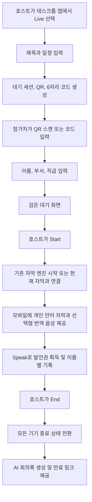
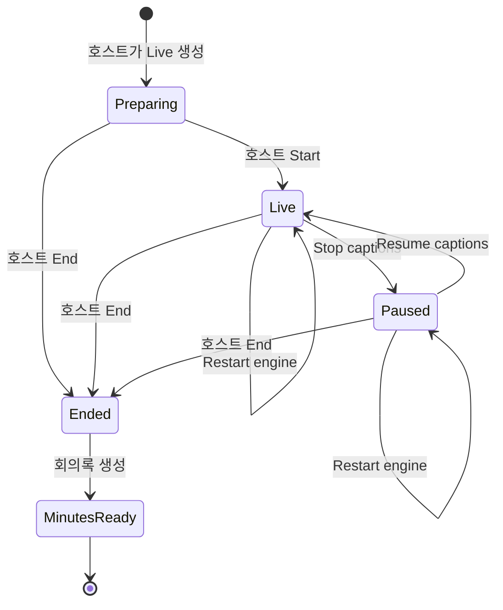

# Realtime Noel Live Call - 제품 의도 및 통합 수정 기획서

문서 기준일: 2026-07-23  
문서 상태: 구현 및 검증 진행 기준안  
대상 제품: Realtime Noel macOS 호스트 프로그램 + QR 기반 모바일 웹  
프로젝트 경계: Autopreso와 분리된 독립 제품

---

## 1. 문서 목적

이 문서는 Realtime Noel을 단순한 실시간 번역 자막 프로그램에서, 현장 회의·어닝콜·발표 참가자가 각자의 모바일 기기로 실시간 자막과 번역 음성을 함께 소비하고 발언과 회의 기록까지 관리하는 제품으로 확장하기 위한 의도와 수정 기획을 정리한다.

이 문서의 우선순위는 다음과 같다.

1. 사용자가 말한 제품 의도를 왜곡 없이 보존한다.
2. 기존 Realtime Noel의 핵심 자막 기능과 새 Live Call 기능의 관계를 명확히 한다.
3. 호스트 프로그램, 모바일 참가자 화면, 세션 수명주기, 데이터와 보안 정책을 하나의 기준으로 통일한다.
4. 구현·검수·향후 배포 판단의 기준 문서로 사용한다.

---

## 2. 사용자 의도 선언

Realtime Noel의 중심은 언제나 실시간 자막이다. 프로그램으로 들어오는 음성을 인식하고 선택한 언어로 자막을 출력하는 기존 기능은 독립적으로 계속 동작해야 한다.

Live Call은 이 기본 기능을 대체하는 별도 제품이 아니라, 현재 생성되는 자막과 번역을 회의 참가자들이 각자의 모바일 기기에서 함께 볼 수 있도록 확장하는 선택 기능이다.

사용자가 원하는 최종 경험은 다음과 같다.

- 호스트가 Realtime Noel 데스크톱 프로그램에서 Live를 누르면 회의 세션이 준비된다.
- 세션 제목, 일정 또는 시작 예정 시간을 호스트가 설정할 수 있다.
- 프로그램에는 전용 QR과 세션이 종료될 때까지 유지되는 6자리 인증번호가 표시된다.
- 참가자는 QR을 스캔하거나 인증번호를 입력해 모바일 웹으로 들어간다.
- 참가자는 계정과 비밀번호 없이 이름, 부서, 직급만 입력한다.
- 공유받은 링크로 늦게 입장한 사람도 자신의 정보를 새로 입력해야 한다.
- 호스트가 Start를 누르기 전까지 참가자는 검은 대기 화면에 머문다.
- 호스트가 Start를 누르면 기존 자막 생성과 실시간 번역이 시작되고, 참가자의 모바일 화면에도 동기화된다.
- 참가자는 한국어 또는 영어 중 자신이 원하는 자막 언어와 번역 음성 언어를 개인적으로 선택한다.
- 발언하려는 참가자는 Speak 버튼을 누른다.
- 동시 발언자는 한 명만 허용되며, 새로운 발언권이 확정되면 이전 발언자는 즉시 종료된다.
- 발언 내용은 참가자의 이름, 부서, 직급에 연결되어 자막과 회의 기록에 남는다.
- 모바일은 검은 전체화면 위에 큰 흰 자막이 계속 올라가는 단순한 시청 경험을 제공한다.
- 참가자는 이전 자막을 위로 스크롤해 다시 볼 수 있다.
- 호스트는 화면 공유 여부, 공개 자막 여부, 제공 언어, 발언권과 세션 종료를 통제한다.
- Restart는 자막 엔진의 새로고침이며 Live Session을 끝내지 않는다.
- Stop은 자막을 일시 정지할 뿐 세션을 종료하지 않는다.
- 오직 호스트의 명시적인 End만 전체 세션을 종료한다.
- 종료 후 자막을 기반으로 회의 요약, 결정 사항, 액션 아이템과 화자별 발언 기록을 볼 수 있어야 한다.
- 원본 음성·영상은 기본 저장하지 않고 자막과 구조화된 회의록만 저장한다.

---

## 3. 한 줄 제품 정의

Realtime Noel은 호스트의 실시간 번역 자막을 현장 참가자의 모바일로 동기화하고, 개인별 언어·번역 음성·발언권·화자 기록·AI 회의록까지 하나의 세션으로 관리하는 회의용 통역 플랫폼이다.

---

## 4. 제품이 해결하려는 문제

### 4.1 현장 자막의 개인화 부족

기존 자막은 호스트 화면 또는 공유 화면에만 표시되기 때문에 참가자가 자신의 자리에서 읽기 어렵다. 참가자별로 필요한 언어도 다르지만 하나의 공유 화면만으로는 개인 선택을 제공하기 어렵다.

### 4.2 발언자 식별과 기록의 단절

여러 사람이 참여하는 회의에서는 누가 어떤 말을 했는지 나중에 구분하기 어렵다. 자막이 생성되더라도 참가자 신원과 연결되지 않으면 신뢰할 수 있는 회의록으로 전환하기 어렵다.

### 4.3 실시간 통역 음성의 접근성

통역 음성을 회의장 전체에 일괄 재생하면 사람마다 원하는 언어가 다르고 원음 청취를 방해할 수 있다. 각 참가자가 자신의 모바일에서 선택한 언어만 들어야 한다.

### 4.4 세션 종료와 엔진 복구의 혼동

자막 엔진에 문제가 생겨 Restart가 필요할 때 Live Session까지 종료되면 QR, 참가자, 발언권과 기록이 모두 끊긴다. 엔진 복구와 회의 종료는 서로 다른 상태 전환이어야 한다.

### 4.5 회의 종료 후 활용성 부족

실시간 자막만 제공하고 끝나면 결정 사항과 후속 조치를 다시 수작업으로 정리해야 한다. 화자별 확정 자막을 구조화된 회의록으로 전환해야 한다.

---

## 5. 제품 원칙

### 5.1 자막 우선

Realtime Noel의 기본 기능은 데스크톱 실시간 자막이다. Live Call을 사용하지 않아도 기존 자막 생성, 번역, 오버레이와 컨트롤러는 정상 동작해야 한다.

### 5.2 Live Call은 선택 기능

Live Call은 기본 자막 스트림을 참가자에게 확장하는 옵션이다. 세션 생성 실패나 모바일 연결 실패가 호스트의 기본 자막 기능을 중단시키면 안 된다.

### 5.3 호스트 주도

세션 생성, 시작, 화면 공유, 자막 공개, 제공 언어, 발언권 관리와 종료는 호스트만 수행한다. 모바일 참가자는 세션을 만들 수 없다.

### 5.4 참가자별 개인 설정

자막 언어, 번역 음성 재생, 글자 크기와 과거 자막 탐색은 참가자 개인 설정이다. 한 참가자의 설정 변경이 다른 참가자나 호스트 화면에 영향을 주지 않는다.

### 5.5 명확한 종료

Restart와 Stop은 세션 종료가 아니다. 호스트의 End만 종료이며, End 이후 모든 연결 기기가 동일한 종료 상태와 회의록 화면으로 전환되어야 한다.

### 5.6 최소 개인정보 저장

기본 저장 대상은 참가자가 입력한 이름, 부서, 직급, 확정 자막과 회의록이다. 원본 음성과 영상은 기본적으로 저장하지 않는다.

### 5.7 단순하고 읽기 쉬운 디자인

모바일은 순수 검정 배경, 큰 흰 자막, 회색 메타 정보와 최소한의 조작만 사용한다. 장식적 그라디언트, 이모지, 불필요한 카드와 설명 문구는 사용하지 않는다.

---

## 6. 제품 범위

### 6.1 포함

- macOS DMG 호스트 프로그램의 전체 UI 재구성
- 기존 마이크·시스템 오디오 기반 실시간 자막
- 기존 자막 컨트롤러 유지 및 디자인 정리
- 선택형 Live Call 세션
- 호스트 전용 세션 생성
- 회의 제목과 일정 또는 시작 예정 시간 입력
- 세션 전용 QR
- 세션 종료까지 유지되는 6자리 인증번호
- QR 서명 링크와 링크 공유
- 이름·부서·직급 기반 임시 게스트 입장
- 호스트 시작 전 모바일 대기 화면
- 검은 전체화면 기반 모바일 실시간 자막
- 과거 자막 스크롤
- 개인별 한국어·영어 자막 선택
- 개인별 번역 음성 재생 선택
- 모바일 글자 크기 조절
- 모바일 미팅 나가기
- Speak 버튼과 단일 발언권
- 화자 신원과 자막 연결
- 참가자 입장·퇴장·발언 활동 집계
- 호스트 선택형 화면 공유와 자막 공개
- 네트워크 재접속과 누락 없는 자막 복구
- 호스트 End에 따른 전체 세션 종료
- AI 회의 요약, 결정 사항, 액션 아이템과 화자별 요약
- 호스트 및 참여자용 만료 회의록 링크
- 기존 Supabase 구조를 보존하는 추가형 마이그레이션
- 기능 플래그 기반 점진 전환

### 6.2 기본 제외

- 원본 음성 녹음 저장
- 원본 영상 녹화 저장
- 모바일 네이티브 앱
- 참가자의 Live Session 생성
- 이메일·비밀번호 기반 정식 회원가입
- 여러 명의 동시 발언
- Autopreso 기능과의 필수 결합
- 사용자 승인 없는 운영 환경 배포

### 6.3 향후 옵션

- 한국어·영어 외 추가 언어
- 조직 계정 및 관리자 콘솔
- 회의록 장기 보관 정책
- 회의 플랫폼 연동
- 관리자 승인형 참가자 입장
- 별도 원음·녹화 보관 옵션

---

## 7. 사용자와 권한

| 역할 | 주요 권한 |
|---|---|
| HOST | 세션 생성, 제목·일정 설정, QR·인증번호 표시, 시작, 자막 공개, 화면 공유, 제공 언어 설정, 참가자 확인, 발언권 통제, 자막 정지·재개·Restart, 세션 End, 회의록 접근 관리 |
| GUEST | 이름·부서·직급 입력, QR 또는 인증번호 입장, 개인 언어·음성·글자 크기 설정, Speak 요청, 자막 스크롤, 미팅 나가기, 자신이 참여한 회의의 만료 회의록 열람 |

권한 원칙:

- 세션 생성 API와 호스트 제어 API는 호스트 인증과 세션 소유권을 확인한다.
- 게스트 링크는 세션을 식별할 뿐 참가자 신원을 대신하지 않는다.
- 공유 링크를 받은 사람도 반드시 자신의 이름, 부서, 직급을 입력한다.
- 게스트는 다른 세션의 참가자 목록이나 회의록에 접근할 수 없다.
- 호스트 인증이 없는 일반 웹 사용자는 Live Session을 생성할 수 없다.

---

## 8. 핵심 사용자 흐름

### 8.1 정상 흐름

### 8.2 QR 입장

1. 호스트가 Live를 선택하면 서버가 세션과 서명된 초대 링크를 만든다.
2. 호스트 화면에서 링크를 QR로 표시한다.
3. 참가자가 QR을 스캔하면 세션은 자동 식별된다.
4. 모바일 입장 화면에는 이름, 부서, 직급과 입장 버튼만 표시한다.
5. 입장 후 호스트가 시작하지 않았다면 검은 대기 화면을 표시한다.
6. 세션이 이미 진행 중이면 현재 자막 스트림에 바로 합류한다.

### 8.3 인증번호 입장

1. QR을 스캔할 수 없는 사용자는 모바일 입장 화면에서 인증번호 방식을 선택한다.
2. 호스트 화면의 QR 아래에 표시된 6자리 코드를 입력한다.
3. 코드 확인 후 이름, 부서, 직급으로 입장한다.
4. 코드는 세션이 명시적으로 종료될 때까지 유지된다.
5. Restart, Stop, 자막 설정 변경과 재접속은 코드를 바꾸지 않는다.

### 8.4 공유 링크와 늦은 입장

1. 이미 입장한 사용자가 현재 링크를 다른 참가자에게 공유할 수 있다.
2. 링크를 받은 사람은 기존 참가자의 신원을 승계하지 않는다.
3. 새 참가자는 자신의 이름, 부서, 직급을 입력한다.
4. 진행 중인 세션이면 최근 확정 sequence부터 안전하게 동기화한 뒤 Live 상태로 합류한다.

### 8.5 발언

1. 참가자가 Speak를 누른다.
2. 서버가 발언권을 원자적으로 획득하거나 기존 화자로부터 이전한다.
3. 새 화자가 확정되면 이전 화자의 발언 상태를 즉시 종료한다.
4. 현재 화자의 이름, 부서와 직급을 모바일·호스트 화면에 표시한다.
5. 발언에서 생성된 확정 자막을 참가자 ID에 연결한다.
6. 발언 종료 시 발언 횟수와 시간을 집계한다.

### 8.6 Restart, Stop, End

| 동작 | 자막 엔진 | Live Session | QR·코드 | 참가자·기록 |
|---|---|---|---|---|
| Restart | 재초기화 | 유지 | 유지 | 유지 |
| Stop | 일시 정지 | 유지 | 유지 | 유지 |
| Resume | 재개 | 유지 | 유지 | 유지 |
| End | 종료 | 종료 | 무효화 | 확정 후 회의록 전환 |

이 구분은 제품의 핵심 불변 조건이다.

---

## 9. 모바일 웹 기획

### 9.1 입장 화면

QR 경로:

- Realtime Noel 브랜드
- 이름
- 부서
- 직급
- Enter 버튼

인증번호 경로:

- QR을 사용할 수 없는 경우에만 Access code 탭 또는 보조 진입 제공
- 6자리 인증번호
- 이름
- 부서
- 직급
- Enter 버튼

입장 화면에서 삭제할 요소:

- “내 언어로 함께 듣기”와 같은 홍보성 제목
- 긴 기능 설명
- 아이디·비밀번호가 필요 없다는 반복 설명
- QR로 이미 세션을 식별했는데 다시 코드를 입력하게 하는 필드
- 장식 목적의 카드와 불필요한 시각 요소

### 9.2 대기 화면

- 순수 검정 배경
- 회의 제목
- 일정 또는 시작 예정 시간
- “Waiting for host” 상태
- 나가기
- 호스트가 Start하면 별도 새로고침 없이 Live 화면으로 전환

### 9.3 Live 자막 화면

- 전체화면 검정 배경
- 큰 흰색 확정 자막
- 현재 진행 중인 자막은 시각적으로 구분
- 화자 이름과 소속 정보는 회색 메타 정보로 표시
- 최신 자막은 아래에 쌓이고 자연스럽게 위로 이동
- 사용자는 위로 드래그해 과거 자막 탐색
- 사용자가 과거를 읽는 동안 자동 스크롤을 강제로 되돌리지 않음
- 최신으로 돌아가는 명확한 제어 제공

### 9.4 하단 컨트롤

- 한국어·영어 선택
- 선택 언어의 번역 음성 On/Off
- 언어 버튼 오른쪽 끝에 글자 크기 조절
- 현재 화자 상태
- Speak 버튼
- 발언 중지
- 미팅 나가기

### 9.5 모바일 접근성

- iPhone Safari와 Android Chrome 기준
- 안전 영역을 고려한 하단 컨트롤
- 키보드와 스크린리더용 명확한 label
- 충분한 터치 영역
- 연결 끊김, 재접속, 대기, 종료 상태를 색상만으로 구분하지 않음

---

## 10. 호스트 프로그램 기획

### 10.1 기본 원칙

- 데스크톱 자막이 항상 주 화면의 중심이어야 한다.
- Live Call은 필요할 때 여는 선택 제어 영역이다.
- 기존 자막 컨트롤러를 제거하지 않는다.
- “Live Interpretation, in Every...” 문구는 삭제하고 브랜드를 “Realtime Noel”로 통일한다.

### 10.2 유지해야 할 자막 컨트롤

- Start
- Stop
- Restart
- 자막 크기 A- / A+
- 최대 자막 표시량 또는 capacity
- 자막 위치 Top / Middle / Bottom
- 투명도
- 원문·번역 언어 설정
- 자막 숨김
- 앱 종료

### 10.3 Live Session 준비 화면

- 회의 제목
- 날짜와 시간 또는 시작 예정 시간
- Create Live Session
- QR
- QR 아래의 고정 6자리 인증번호
- 링크 복사
- 입장한 참가자 수
- Start Live

### 10.4 Live 진행 화면

- 현재 생성 중인 자막과 확정 자막
- 번역 상태와 지연 상태
- QR과 인증번호를 다시 열 수 있는 초대 제어
- 참가자 목록
- 이름, 부서, 직급
- 입장·퇴장 상태
- 현재 발언자
- 발언 횟수와 누적 발언 시간
- 최근 발언
- 화면 공유 On/Off
- 모바일 자막 공개 On/Off
- 제공 언어
- Stop / Resume captions
- Restart engine
- End Session

### 10.5 호스트 종료

End Session은 실수 방지를 위해 다른 자막 제어와 명확히 분리한다.

1. 호스트가 End Session을 선택한다.
2. 종료 확인을 거친다.
3. 서버가 세션 상태를 종료로 확정한다.
4. QR 링크와 인증번호의 신규 입장을 차단한다.
5. 모바일 기기를 종료 상태로 전환한다.
6. 발언권과 진행 중 자막을 안전하게 마감한다.
7. 확정 자막을 기반으로 회의록을 생성한다.

---

## 11. 화면 공유와 자막 공개

화면 공유는 Live 중에도 사용할 수 있지만 자막 기능과 독립적으로 제어한다.

- 호스트가 화면 공유 여부를 선택한다.
- 호스트가 공유 화면 위에 자막을 표시할지 선택한다.
- 모바일 참가자는 화면 공유 중에도 자신의 자막을 계속 볼 수 있다.
- 화면 공유가 중지되어도 자막과 Live Session은 유지된다.
- 자막 엔진 Restart가 화면 공유 세션을 종료시키지 않는다.

---

## 12. 실시간 번역 음성

### 12.1 개인별 재생

- 참가자는 한국어 또는 영어 중 듣고 싶은 언어를 선택한다.
- 번역 음성은 참가자 자신의 모바일 스피커 또는 이어폰으로 재생한다.
- 번역 음성 설정은 다른 참가자에게 영향을 주지 않는다.
- 자막은 음성 재생 여부와 관계없이 계속 표시된다.

### 12.2 발언권과 음성 처리

- 한 시점에 한 명만 공식 발언자로 처리한다.
- 새로운 Speak가 확정되면 기존 화자의 발언 스트림을 종료한다.
- 네트워크 지연으로 두 명이 동시에 Speak를 눌러도 서버가 단일 화자를 확정한다.
- 번역 음성은 확정된 화자의 발언만 기준으로 생성한다.

### 12.3 브라우저 제약

모바일 브라우저의 자동 재생 정책 때문에 사용자가 최초 한 번 음성 재생을 명시적으로 활성화해야 할 수 있다. 이 동작은 오류가 아니라 브라우저 보안 정책으로 안내한다.

---

## 13. 데이터 모델 방향

기존 Supabase 구조를 유지하고 새 필드와 테이블을 추가하는 방식으로 확장한다. 기존 컬럼이나 enum은 즉시 삭제하지 않는다.

### 13.1 주요 엔티티

| 엔티티 | 역할 |
|---|---|
| `live_sessions` | 제목, 일정, 상태, 호스트, 공개 설정, 종료 상태, 입장 세대 관리 |
| `viewer_grants` | QR 또는 코드 입장 권한, 이름, 부서, 직급과 만료 |
| `live_participants` | 참가자 신원, 입장·퇴장, 연결 상태, 발언 횟수와 시간 |
| `live_participant_events` | 입장, 퇴장, Speak 요청, 발언권 획득·종료 이벤트 |
| `live_utterances` | 확정 자막, 번역, sequence, 화자와 시간 |
| `meeting_summaries` 또는 기존 회의록 저장 구조 | 요약, 결정, 액션 아이템, 화자별 요약과 접근 정책 |

### 13.2 참가자 신원

- `participantId`는 한 세션 안에서 안정적으로 유지한다.
- 이름, 부서, 직급은 입장 시 검증하고 정규화한다.
- 링크 자체에 참가자 개인정보를 포함하지 않는다.
- 재접속 시 참가자 권한이 유효하면 동일 참가자로 복원한다.

### 13.3 자막 sequence

- 모든 확정 자막은 세션 내 단조 증가 sequence를 가진다.
- 클라이언트는 마지막 수신 sequence를 기억한다.
- 재접속 시 마지막 sequence 이후만 요청한다.
- 같은 sequence는 중복 표시·중복 저장하지 않는다.

---

## 14. 세션 상태 모델

불변 조건:

- Restart는 상태를 `Ended`로 바꾸지 않는다.
- Stop은 QR과 인증번호를 무효화하지 않는다.
- End 이후에는 Start, Resume, Speak와 신규 입장을 허용하지 않는다.
- 세션 버전 또는 원자적 상태 조건을 사용해 중복 Start·End를 방지한다.

---

## 15. 실패 및 복구 시나리오

### 실패 A - 두 명이 동시에 Speak

- 서버가 원자적으로 한 명의 발언권만 확정한다.
- 정책이 선점형이면 마지막으로 확정된 참가자가 화자가 되고 이전 화자는 즉시 종료된다.
- 두 사람 모두 자신이 화자라고 표시되는 분할 상태가 1초 이상 지속되면 실패다.

### 실패 B - 네트워크 단절 후 재접속

- 클라이언트가 마지막 sequence와 참가자 권한을 유지한다.
- 재접속 후 누락된 확정 자막만 보충한다.
- 중복 자막, 다른 참가자로의 잘못된 복원과 종료 상태 누락이 없어야 한다.

### 실패 C - 자막 엔진 오류와 Restart

- 호스트가 Restart를 누르면 오디오·번역 파이프라인만 재초기화한다.
- Live Session ID, QR, 인증번호, 참가자, 발언 기록과 회의 제목은 유지한다.
- 모바일은 연결 상태 안내 후 같은 세션에서 다시 자막을 받는다.

### 실패 D - 늦은 참가자의 공유 링크 입장

- 링크가 유효하면 새 참가자 정보 입력 화면을 표시한다.
- 기존 공유자의 이름이나 권한을 복제하지 않는다.
- 종료된 세션 링크라면 신규 입장을 거부하고 종료 상태를 표시한다.

### 실패 E - 호스트 강제 종료 또는 앱 장애

- 일시적인 앱 재시작은 세션 End로 간주하지 않는다.
- 호스트가 복구 가능한 시간 안에 돌아오면 기존 세션을 재연결한다.
- 명시적인 End 또는 서버의 정책상 만료만 최종 종료로 처리한다.

---

## 16. AI 회의록

### 16.1 입력

- 회의 제목과 일정
- 확정 자막
- 원문과 번역문
- 화자 이름, 부서, 직급
- 발언 시작·종료 시간
- 참가자별 발언 횟수와 누적 시간
- 입장·퇴장 이벤트

원본 음성이나 영상은 기본 입력으로 사용하지 않는다.

### 16.2 출력 구조

- 회의 제목
- 전체 요약
- 시간 또는 주제별 장
- 주요 논의
- 결정 사항
- 액션 아이템
- 담당자
- 기한 또는 미정 상태
- 화자별 핵심 발언
- 참가 통계
- 생성 시간과 사용 모델

### 16.3 생성 원칙

- OpenAI Responses API의 Structured Outputs를 사용해 정해진 스키마로 생성한다.
- 자막에 없는 결정이나 담당자를 추정해서 만들지 않는다.
- 불명확한 담당자·기한은 “미정”으로 남긴다.
- 모델 거부, 형식 오류 또는 저장 실패를 정상 성공으로 처리하지 않는다.
- AI 결과는 호스트가 검토할 수 있어야 한다.

### 16.4 열람 정책

- 기본 보관 기간은 30일이다.
- 호스트와 해당 회의 참가자만 만료 링크로 열람한다.
- 만료 후 신규 접근을 거부한다.
- 장기 보관은 향후 명시적 옵션으로 분리한다.

---

## 17. 보안과 개인정보

### 17.1 초대 보안

- QR은 세션별 만료 서명 링크다.
- 6자리 코드는 서버에서 검증하며 평문을 데이터베이스에 장기 저장하지 않는다.
- 코드 입력은 IP, 기기, 세션과 전체 범위에서 속도 제한한다.
- QR과 코드는 세션 End 또는 정책상 만료 후 사용할 수 없다.

### 17.2 입력 보안

- 이름, 부서, 직급, 제목과 일정은 길이·제어문자·HTML을 검증한다.
- 사용자 입력과 AI 출력은 저장·표시 경계에서 정제한다.
- 빈 문자열, 과도한 길이, 비정상 유니코드와 자동화된 대량 입력을 거부한다.

### 17.3 호스트 보안

- 모든 상태 변경 API는 호스트 인증, Origin/CSRF와 세션 소유권을 확인한다.
- 세션 상태 변경은 낙관적 잠금 또는 원자적 조건으로 중복 요청을 방지한다.
- DMG 실행 여부만으로 완전한 하드웨어 인증을 보장할 수 없으므로, 현재는 호스트 세션 쿠키와 소유권 검증을 실질 경계로 사용한다.

### 17.4 API 키

- OpenAI API 키는 로컬의 추적되지 않는 환경 파일에만 저장한다.
- 키를 화면, 로그, 문서 또는 저장소에 노출하지 않는다.
- 채팅이나 외부 채널에 노출된 키는 즉시 폐기하고 새 키로 교체한다.

---

## 18. 비기능 요구사항과 성공 기준

| 항목 | 성공 기준 |
|---|---|
| 입장 | QR 스캔 후 이름·부서·직급 입력과 입장까지 두 단계 이내 |
| 자막 지연 | 확정 기준 p95 2.5초 이내 |
| 발언권 전환 | 확정 상태 전환 1초 이내 |
| 동시 접속 | 회의당 최대 50명 |
| 동시 발언 | 1명 |
| 기본 언어 | 한국어, 영어 |
| 재접속 | 마지막 sequence 이후 중복·누락 없이 복구 |
| 종료 | 호스트 End 후 모든 기기가 종료 상태로 전환 |
| 코드 수명 | 세션 End까지 동일 코드 유지 |
| Restart | 세션·QR·코드·참가자·기록 유지 |
| 호환성 | iPhone Safari, Android Chrome, macOS 호스트 시연 통과 |
| 저장 | 원본 음성·영상 제외, 자막·회의록 기본 30일 |

---

## 19. 디자인 기준

### 19.1 공통

- 브랜드명: Realtime Noel
- 검정, 흰색, 중립 회색을 중심으로 사용
- 필요한 상호작용 강조에만 Apple Blue 사용
- 장식적 그라디언트, 질감, 이모지와 다채색 액센트 금지
- 상태와 제어의 위계를 명확히 하고 설명 문구를 최소화

### 19.2 모바일

- 검은 전체화면
- 큰 흰 자막
- 회색 화자·시간 메타
- 하단 고정 컨트롤
- 한국어·영어 선택 오른쪽에 글자 크기 제어
- Speak와 Leave의 기능·위험도 분리
- 스크롤 중 읽던 위치 보존

### 19.3 호스트

- 실시간 자막을 가장 크게 표시
- 참가자와 Live 제어는 보조 패널에 배치
- QR과 코드는 준비·초대 문맥에서 명확히 표시
- Restart, Stop, End를 시각적으로 구분
- End는 파괴적 동작으로 별도 확인
- 기존 컨트롤러의 기능 수를 줄이지 않음

---

## 20. 기술 및 통합 방향

### 20.1 기존 기능

- 기존 Electron 호스트 프로그램
- 기존 마이크 및 시스템 오디오 캡처
- 기존 OpenAI 또는 Gemini 실시간 번역
- 기존 자막 오버레이와 컨트롤러

### 20.2 Live 확장

- Supabase 실시간 세션 상태와 확정 자막 동기화
- 서명된 QR 초대와 HMAC 기반 인증번호 검증
- 참가자별 권한 토큰
- sequence 기반 재접속 복구
- 서버 원자 연산 기반 단일 발언권
- 선택 언어 TTS 전송
- OpenAI Structured Outputs 기반 회의록

### 20.3 WhisperLiveKit 활용 원칙

첨부된 WhisperLiveKit은 전체 제품을 그대로 채택하지 않고 다음 아이디어만 선별 참고한다.

- 스트리밍 음성 구간 처리
- partial과 final transcript 분리
- 연결 복구
- 지연과 버퍼 관리

Realtime Noel의 현재 자막·번역 파이프라인, Supabase 세션 모델과 호스트 제어를 우선하며 프로토콜 충돌이 생기는 구성은 도입하지 않는다.

---

## 21. 구현 단계

### Phase 1 - 세션과 입장

- 호스트 세션 생성
- 제목·일정
- QR과 고정 6자리 코드
- 이름·부서·직급 입장
- 대기·시작·종료 상태
- 링크 공유와 재입력

### Phase 2 - 자막 동기화

- 기존 자막과 Live Session 연결
- 확정 sequence
- 모바일 언어 선택
- 전체화면 자막과 과거 스크롤
- 재접속 복구

### Phase 3 - 발언과 번역 음성

- Speak 요청
- 단일 발언권
- 화자 정보 연결
- 참가자별 선택 언어 TTS
- 발언 통계와 이벤트

### Phase 4 - 호스트 운영 화면

- 참가자 목록
- 화면 공유와 자막 공개
- Stop, Resume, Restart, End 구분
- 현재 화자와 최근 발언
- Live 상태와 장애 표시

### Phase 5 - 회의록

- 종료 시 확정
- 구조화된 AI 요약
- 결정과 액션 아이템
- 화자별 요약
- 만료 링크
- 30일 보관

### Phase 6 - 현장 검증과 점진 전환

- 기능 플래그
- iPhone, Android, PC 호스트 3기기 시연
- 네트워크 단절·복구
- Speak 동시성
- 자막 지연 측정
- 기존 자막 단독 모드 회귀 검증

---

## 22. 테스트 계획

### 22.1 정상 시연

1. 호스트가 제목과 일정을 넣어 Live Session을 만든다.
2. QR과 코드가 표시된다.
3. 두 모바일이 각각 다른 정보로 입장한다.
4. 호스트 Start 후 데스크톱과 모바일에 동일한 확정 자막이 나타난다.
5. 한 모바일은 한국어, 다른 모바일은 영어를 선택한다.
6. Speak 발언이 화자 이름으로 기록된다.
7. Restart 후에도 세션과 참가자가 유지된다.
8. End 후 두 모바일 모두 회의 종료와 회의록 화면으로 이동한다.

### 22.2 적대적 검증

- 두 참가자의 동시 Speak
- Start와 End 연속 중복 클릭
- QR·코드 무차별 대입
- 다른 세션 참가자 권한 재사용
- 종료된 공유 링크 재사용
- 잘못된 이름·부서·직급과 HTML 입력
- 네트워크 끊김 후 sequence 복구
- Restart 중 신규 참가자 입장
- Stop 중 QR과 코드 유지
- 오래된 클라이언트가 종료 상태를 놓치는 경우
- 모바일 오디오 자동 재생 차단
- 호스트 권한 없는 세션 생성 요청

---

## 23. 롤백 전략

- 기존 자막 화면과 동작을 유지한다.
- Live Call은 기능 플래그로 켜고 끈다.
- 데이터베이스 변경은 추가형 마이그레이션만 사용한다.
- 기존 컬럼과 enum은 즉시 삭제하지 않는다.
- Live Call에 문제가 생기면 기능 플래그를 끄고 기본 데스크톱 자막 모드로 복귀한다.
- Restart와 앱 재실행으로 기존 Live Session을 복구할 수 있게 한다.
- 운영 배포는 버그 검사, 로컬 시연과 사용자 명시 승인 후에만 수행한다.

---

## 24. 현재 구현 기준과 남은 검증

현재 수정 방향에 반영된 항목:

- QR과 6자리 코드의 이중 입장 방식
- 이름, 부서, 직급 기반 참가자
- 고정 코드 수명주기
- 호스트 전용 세션 제어
- Restart와 End 분리
- 모바일 전체화면 자막 UI
- 참가자와 발언 활동 데이터
- 구조화된 AI 회의록 계약
- 입력 검증과 코드 속도 제한
- 추가형 Supabase 마이그레이션

배포 전 남은 필수 확인:

- 최신 추가형 마이그레이션을 개발 Supabase 환경에 적용한 실제 검증
- 호스트의 Stop 후 Resume가 동일 세션에서 정상 동작하는지 최종 통합 확인
- 실제 iPhone Safari, Android Chrome, macOS DMG 3기기 시연
- 실환경 자막 지연 p95 측정
- 실제 OpenAI 회의록 생성과 저장 검증
- 종료된 QR·코드·링크의 재사용 차단 검증
- 사용자 승인 후에만 운영 배포

---

## 25. 최종 판단 기준

이 기획은 다음 질문에 모두 “예”라고 답할 수 있을 때 완료된 것으로 본다.

1. Live Call을 사용하지 않아도 기존 Realtime Noel 자막은 그대로 동작하는가?
2. 호스트만 세션을 만들고 종료할 수 있는가?
3. QR과 코드를 통해 누구나 간단히 입장하되 각자 자신의 정보를 입력하는가?
4. 참가자가 원하는 언어의 자막과 음성을 개인적으로 선택할 수 있는가?
5. 모바일에서 자막이 가장 중요한 정보로 보이는가?
6. 동시에 한 명만 발언하고 그 발언이 정확한 참가자에게 연결되는가?
7. Restart와 Stop이 세션을 종료하지 않는가?
8. 호스트 End가 모든 기기에 일관되게 전파되는가?
9. 재접속 뒤 자막이 중복되거나 누락되지 않는가?
10. 종료 후 회의 요약, 결정, 액션 아이템과 화자별 기록을 안전하게 다시 볼 수 있는가?

이 열 가지가 Realtime Noel Live Call의 제품 완성 기준이다.
