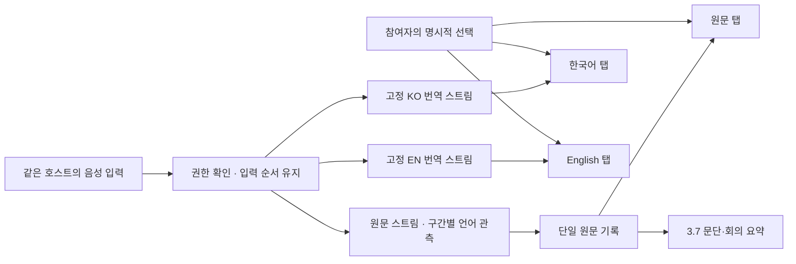

# 참여자 표시 언어 고정과 다국어 원문 처리 설계

작성일: 2026-08-31. 상태: 구현 전 설계. 이번 작업은 코드 조사·로컬 반례 재현·공식 문서 비교이며 운영 코드, DB, 모델 설정, 배포는 변경하지 않았다.

## 1. 결정과 사용자 요구

**참여자의 표시 언어는 참여자가 결정한다. 발언 언어 감지는 원문 정보이며 탭 선택을 변경할 권한이 없다.** 호스트 계정, 음성을 보내는 기기, 실제 화자, 발언 언어, 참여자의 표시 언어를 별개로 취급한다.

| 실제 발언 — 동일 호스트·동일 마이크 | 한국어 탭 | English 탭 | 원문 탭 |
|---|---|---|---|
| A: “매출이 증가했습니다.” | 매출이 증가했습니다. | Revenue increased. | 매출이 증가했습니다. |
| A: “We will expand next year.” | 내년에 확장하겠습니다. | We will expand next year. | We will expand next year. |
| B: “비용은 줄었습니다.” | 비용은 줄었습니다. | Costs decreased. | 비용은 줄었습니다. |
| B: “매출은 늘었지만 costs increased.” | 매출은 늘었지만 비용도 증가했습니다. | Revenue grew, but costs increased. | 매출은 늘었지만 costs increased. |

위 번역은 요구 동작을 설명하는 예시이며 실제 API 측정 결과가 아니다. ‘해당 언어만’은 **본문 내용의 언어**를 의미한다. 숫자·승인된 고유명사·약어를 임의로 번역하거나 지우라는 뜻은 아니다. 언어 감지와 번역 정확도 100%는 약속하지 않으며, 명확한 실패를 다른 언어 원문으로 숨기지 않는다.

- 포함: 안정된 탭, 구간별 언어 관측, 같은 언어·혼합 언어 처리, 원문 순서, 회색/흰색 확정, 화자와 권한 분리, 복구·요약 연결, 구현·검증 순서.
- 제외: 이번 턴의 런타임 수정, 공급자 교체, 유료 API 실험, 실제 화자 신원 등록, 새 이메일 발송, DB 변경·재배포.
- 기존 6시간 기록 열람·인증 복구·요약 요청 동의·호스트 기록 정책은 유지한다. 기존 승인된 화면 토큰과 키보드 접근성도 유지한다.
- 이 문서는 [Live Translate 전환 설계](2026-08-31-live-translate-latency-design.md)를 보완한다. **탭 동등성, 표시 모드, 같은 언어 echo 정책은 이 문서를 우선한다.** 원문 대응·저장 fence·비용·운영 전환의 미확정 조건은 해제하지 않는다.

## 2. 기존 코드에서 확인한 문제

| 구분 | 실제 동작 / 영향 | 근거 |
|---|---|---|
| 현재 결함 | 원문 언어가 `ko`이면 한국어 탭을 중복 제거한다. `en`이면 영어 탭이 사라진다. | `webapp/components/live/translation/topic-presentation.ts:71,88` |
| 현재 결함 | 탭 컴포넌트에서도 중복 제거한다. 선택 탭이 없어지면 원문으로 변경하고 복구 저장값까지 덮을 수 있다. | `TranslationLaneTabs.tsx:30–35`, `LiveViewer.tsx:1753` |
| 현재 결함 | 고정 번역 탭에 `translated`만 허용하므로 같은 언어의 정상 `verbatim` 발언은 누락된다. 탭만 살리는 수정으로 끝나지 않는다. | `topic-presentation.ts:120` |
| 현재 결함 | 기존 `transcriptMode=source/bilingual`가 번역 탭에 적용되어 본문이나 보조행에 다른 언어가 나타난다. | `LiveViewer.tsx:1722`, `ViewerReadingFeed.tsx:32–39` |
| 현재 결함 | 원문을 언어별 캐시에서 합친 순서가 발언 순서와 다를 수 있다. 현재 원문 언어도 선택 언어 캐시에서 계산된다. | `LiveViewer.tsx:1709–1722`, `topic-presentation.ts:138` |
| 현재 결함 | 한글 3자·20% 규칙은 혼합 문장 전체를 한국어로 판정한다. `오늘 매출은 증가했습니다. Revenue is down.`을 KO에 그대로 내보내는 반례를 재현했다. | `packages/caption-core/language-gate.js:59`, `media-gateway/src/live-media-pipeline.js:761` |
| 현재 결함 | 언어 정보 없는 `2026`을 내부값 `unknown`으로 저장하려다 검증 실패한다. 이후 정상 원문까지 source 실패 상태에 막힌다. 실제 publisher + 가짜 네트워크로 재현했다. | `live-media-pipeline.js:715–725,937`, `supabase-adapters.js:789` |
| 현재 불일치 | 언어 정보 없는 명확한 한국어는 원문 저장에서 `ko`, 자막에서 `null`을 쓴다. 서로 다른 변수를 판단에 사용한다. | `live-media-pipeline.js:715,761,852` |
| 이전 코드 재사용 위험 | 과거 consensus가 오래된 합의를 강한 새 언어 관측보다 우선하거나, source와 target이 같다고 번역 출력을 통째로 버린다. 현재 운영 STT 경로의 전환 지연으로 단정하지 않는다. | `packages/caption-core/source-consensus.js:103`, `live-media-pipeline.js:1198,1423` |

현재 전사 adapter는 호스트 입력에 `speakerLabel: "1"`을 붙인다(`google-provider-adapters.js:95`). 이것은 같은 마이크 앞의 사람을 자동으로 구별했다는 근거가 아니다.

## 3. 공식 서비스 계약과 적용 판단

| 서비스 | 확인한 계약 | 이 프로젝트에 적용할 판단 |
|---|---|---|
| Google Gemini 3.5 Live Translate | `targetLanguageCode`와 입력/출력 전사를 설정한다. `echoTargetLanguage=false`는 동일 언어 입력에 무음, `true`는 되풀이 음성 생성이다. 빠른 언어 전환은 입력 전사에 문제를 줄 수 있다. | 출력 언어를 고정한다. 같은 언어에서도 target 스트림이 필요하므로 `true`를 우선 실험하되, 무누락 자막은 보장된 것으로 취급하지 않는다. [공식 가이드](https://ai.google.dev/gemini-api/docs/live-api/live-translate) |
| Azure 후보 기반 Continuous LID | 입력 후보 감지와 번역 대상 설정은 별개다. 같은 문장 안의 언어 전환은 지원하지 않으며 후보 밖 언어도 후보 중 하나로 반환할 수 있다. | 최초 언어로 회의를 잠그지 않는다. 후보 목록이 감지의 확실성을 보장하지도 않는다. [언어 식별](https://learn.microsoft.com/en-us/azure/ai-services/speech-service/language-identification) |
| Azure 무후보 다국어 번역 | `FromOpenRange`는 후보 없이 입력 언어를 감지한다. 이 모드에서는 중간 번역 결과를 제공하지 않는다. | 회색 중간 번역이 필요한 화면에 동등한 대체재로 가정하지 않는다. 위 Continuous LID와 구분한다. [번역 가이드](https://learn.microsoft.com/en-us/azure/ai-services/speech-service/how-to-translate-speech#multi-lingual-speech-translation-without-source-language-candidates) |
| DeepL Voice | `source_language_mode:auto`는 입력 언어 힌트를 변경할 수 있고, `fixed`는 강제한다. `target_languages`는 독립 설정하며 최대 5개다. 음성 출력 설정을 생략한 텍스트 출력이 가능하다. | 입력 감지와 출력 선택을 분리하는 참고 사례다. 문장 내 혼용·같은 언어 echo·재감지 주기까지 보장한다고 확대하지 않는다. [세션 설정](https://developers.deepl.com/api-reference/voice/request-session) |
| DeepL 스트리밍 | `tentative`는 변경 가능하고 `concluded`는 불변이다. 입력 종료 뒤 최종 결과와 `end_of_stream`을 받는다. | 중간/최종 이벤트를 명시적으로 나누는 계약을 참고한다. 이것만으로 원문·번역 문장이 1:1이라고 가정하지 않는다. [스트리밍](https://developers.deepl.com/api-reference/voice/websocket-streaming) |

이 비교는 문서상의 기능 비교다. 한국어 인식률·지연·비용의 실측 순위가 아니며 Azure/DeepL로 교체하자는 결정도 아니다.

## 4. 최소 상태 분리

| 상태 | 결정 주체 / 변경 조건 | 하지 않는 일 |
|---|---|---|
| `hostUserId`, capture owner | 기존 인증·발언권·기기 소유권 | 언어 감지로 호스트 변경 |
| runtime epoch / provider generation | 기존 연결 수명·소유권 전이 | 단순 EN↔KO 전환에 재연결 |
| `speakerSegmentId`, 귀속 근거 | 검증된 화자 분리 또는 발언권 정보 | 언어가 달라졌다고 다른 사람으로 판정 |
| 구간별 source observation | 해당 원문 구간의 provider 정보·보조 검사 | viewer target·다른 과거 구간 덮어쓰기 |
| `selectedLaneId` | 명시적인 참여자 선택·검증된 복구 | 최신 sourceLanguage에 맞춰 자동 변경 |
| `preferredTargetLanguage` | 마지막 명시적 번역 언어 선택 | 원문 탭을 눌렀다고 초기화 |
| interface language | 기존 UI 번역 설정 | 자막 언어와 혼용 |

호스트 입력의 물리적 화자 구별이 불가능하면 ‘발표자’와 식별 미상 상태를 사용한다. 인증된 기기 소유자를 실제 발언자로 허위 확정하지 않는다. 신원이 없는 구분 결과는 ‘화자 1/2’ 같은 익명 구분이지 계정 ID가 아니다. diarization 도입은 별도 지원 검증이 필요하며, **화자 식별 없이도 표시 언어 고정은 작동해야 한다.**

구간의 언어 관측은 `single | mixed | unknown`을 구분한다. 후보 언어, provider 원래 코드, 판단 근거를 보존하되 휴리스틱의 숫자를 확률처럼 표시하지 않는다. DB의 기존 언어 필드에는 내부 문자열 `unknown/mixed`를 그대로 넣지 않는다. 미상·혼합은 `und`로 정규화하고 분류 정보는 별도 DTO/메타데이터로 전달한다. 이 추가 계약은 구현 단계에서 validator와 저장·조회 DTO를 함께 맞춘다.

## 5. 권장 흐름



이 그림은 논리적인 스트림 구분이다. Live Translate에서 별도 전사 연결을 추가한다는 뜻은 아니다. 앞선 설계처럼 고정 leader 연결의 input 전사를 단일 원문으로 쓰고 각 연결의 output을 target로 사용한다. 원문 선택자가 없어도 기록·요약에 필요한 source 처리는 유지한다. 설정된 언어 세션은 회의 단위로 공유하며 source 언어가 바뀌어도 KO/EN 연결의 target은 바꾸지 않는다.

### 5.1 탭과 화면 투영

탭 목록은 `source + session.languages`로만 만든다. `source`와 `translation:ko`는 서로 다른 보기이므로 언어가 같아도 중복이 아니다. 언어 별칭 정규화는 기존 지원 목록을 사용하고, 의도적인 지역 변형을 무조건 base language로 합치지 않는다. 아래는 구현용 계약 의사코드다.

```text
buildTabs(sessionLanguages):
  return [source] + uniqueSupportedTargets(sessionLanguages).map(translationTab)

onSourceObservation(observation):
  updateOnlyThatSourceSegment(observation)
  // selectedLaneId, preferredTargetLanguage, provider target는 변경하지 않는다.

selectFeed(selection):
  if selection.kind == source:
    return canonicalSourceLedger.orderedBySourceSequence()
  return targetLedger[selection.language].orderedByLaneSequence()
```

- 한국어/영어 탭 본문은 해당 target ledger만 읽는다. 번역문과 검증된 동일 언어 결과 모두 포함하며 `translated`만 필터하지 않는다.
- 이 참여자 화면에서는 기존 `source/bilingual` 표시 모드가 target 본문을 바꾸지 못하게 한다. 원문 확인은 별도의 원문 탭에서 한다. 이 화면의 해당 선택 컨트롤·표시 모드 칩도 제거해 동작하지 않는 선택지를 남기지 않는다. 저장된 예전 표시 모드는 화면에 적용하지 않되 다른 제품의 표시 모드를 함께 삭제하지 않는다.
- source 탭은 다국어 캐시 합집합에 의존하지 않는다. 단일 원문 구독·snapshot이 필요하다. 기존 허가된 참여자 경계 안에서 DTO를 추가하고, 관리자 전용 원문 API를 참여자에게 개방하지 않는다.
- 원문 정렬은 canonical source sequence, target 정렬은 각 lane sequence를 사용한다. 수신 시각, 언어별 배열 순서, 화면에 먼저 도착한 순서로 정렬하지 않는다.
- 원문 행의 `lang`은 각 구간을 따른다. 정확한 mixed span 정보가 없으면 문자별 언어를 추측하지 않고 혼합/미상으로 둔다. target 행의 `lang`은 고정 target이다.
- 탭 ID·순서·키보드 초점은 언어 관측으로 변하지 않는다. 지원 언어가 실제로 제거되었을 때만 안내 후 새 선택을 정하며, provider 장애는 지원 언어 제거로 취급하지 않는다.

### 5.2 언어 감지와 동일 언어 처리

감지 순서는 **구간 식별 → provider 언어 정보 보존 → 문자·문법의 보조 증거 검사 → single/mixed/unknown 기록**이다. source 판정과 자막 DTO가 하나의 결정값을 공유한다. 번역으로 만들어진 문장을 원문의 언어 감지 증거로 역사용하지 않는다.

| 입력 | 판정·처리 |
|---|---|
| 명확한 한국어 뒤 명확한 영어 | 새 구간에 새 언어를 적용한다. 이전 문장 합의를 기다리지 않는다. |
| `2026`, `...`, `OK`, 짧은 이름 | 숫자·기호만이면 language-neutral, 그 외 근거 부족이면 unknown. 이전 언어를 확정 사실로 복사하거나 원문 저장을 실패시키지 않는다. |
| 한국어 문장 + 영어 독립 절 | mixed 가능성. 한국어가 많다는 이유로 전체를 KO passthrough하지 않는다. |
| 한국어 + `NOI`, `ADR`, 등록 회사명 | 약어·고유명사만으로 EN 전환을 선언하지 않는다. 반대로 영어 절 전체를 고유명사로 예외 처리하지 않는다. |
| 로마자로 쓰인 다른 언어 | 로마자 비율만으로 영어 확정 불가. 기존 베트남어·외국어 사전 검사는 거절 보조 신호일 뿐 완전한 감지기가 아니다. |
| provider 메타데이터와 내용 충돌 | 원문을 삭제하지 않고 conflicting/unknown 증거를 남긴다. target 결과에 원문을 대신 넣지 않는다. |

기존 2초 hold, 4초 투표, 15초 fallback을 번역 시작 조건으로 가져오지 않는다. 잠깐의 언어 라벨 흔들림 완화가 필요하면 라벨에만 적용하고 최신 구간 번역·원문 표시는 기다리지 않는다. 짧은 발언을 번역하기 위해 이전 언어로 세션 전체를 잠그지도 않는다.

**현재 전사→텍스트 번역 profile**에서는 전체 구간이 target와 같은 언어임이 충분히 확인될 때만 passthrough한다. 숫자·기호만인 구간은 중립 원문 복사가 가능하다. mixed/unknown/충돌이면 고정 target으로 전체 의미를 번역한다. 기존 `sourceLaneMatches=true`와 한글 비율만으로 허가하지 않는다. 입력의 잘못된 단일 언어 힌트를 강제하지 않는다. 원문과 변환 결과는 별도로 보존한다.

**제안하는 3.5 Live Translate profile**에서는 provider가 고정 target으로 만든 output을 사용한다. local source 감지가 target과 같다는 이유로 output을 버리지 않는다. input 원문과 output을 임의로 이어 붙여 혼합 문장의 번역을 만드는 방식도 쓰지 않는다.

### 5.3 Google 동일 언어 연속성 정책

새 요구에는 **`echoTargetLanguage: true`를 우선 검증할 후보로 추천**한다. KO lane에 KO 발언과 EN 발언이 이어져도 같은 output 경로를 사용하기 위한 선택이다. 공식적으로 같은 언어 음성 echo와 출력 전사를 제공하므로 텍스트 연속성을 기대할 수 있지만, 모든 발언의 전사가 빠짐없이 도착한다는 보장은 아니다. 음성 echo를 권위 원문이나 정확한 복제본이라고 부르지 않는다.

`false`는 동일 언어 음성 생성을 억제한다. 해당 구간의 target 전사가 제공되지 않는 경우 원문 passthrough와 번역 output을 합쳐야 하며, 텍스트 이벤트의 실제 동작은 실측으로 확인한다. 특히 혼합 문장에서는 생략/번역된 범위의 대응이 필요하다. **그 대응을 증명하지 못한 `false + 언어 우세 판정` 조합은 이번 요구의 기본안에서 제외한다.** 이전 설계의 `false` 설명은 이 조건을 만족할 때의 대안으로만 남긴다.

Google Translate 전용 모델에는 system instruction으로 ‘항상 한국어’를 추가하지 않는다. 지원되는 설정으로 target를 지정한다. 오디오 입력은 모델 전용 가이드의 PCM·청크 규칙을 따르고, 전사 모델의 설정이나 다른 Live 모델의 일반 가이드를 복사하지 않는다. [모델별 기능](https://ai.google.dev/gemini-api/docs/models/gemini-3.5-live-translate-preview)

생성 오디오를 화면에서 재생하지 않아도 과금이 사라지지 않는다. `true`는 같은 언어 음성도 생성하므로 비용·배경음 영향을 함께 측정해야 한다. 이번 설계는 비용 수용이나 모델 교체 승인으로 간주하지 않는다. [공식 가격표](https://ai.google.dev/gemini-api/docs/pricing)

### 5.4 실패·확정·출처

번역 도착 시 설정된 lane target과 provider output 정보를 비교한다. 명확한 불일치, 비정상 형식, 과도한 길이는 외부 입력 경계에서 거절한다. provider 언어 코드와 문자 검사는 필요 조건이며 번역 의미의 정확성까지 보증하지 않는다. 근거 부족은 검토/미확정 상태로 구분한다. 단순히 target 글자 3개가 들어 있다는 이유로 성공시키지 않는다.

```text
onTargetResult(event, configuredLane):
  reject stale owner/epoch/generation and invalid event shape
  reject known target-language mismatch
  apply monotonic revision to this lane segment only
  if provider final is not verified: show draft in gray
  else if source correspondence is unresolved: keep bounded pending
  else persist source links + final caption under existing write fence
  after durable success: finalize the same row in white
```

원문·번역의 공통 ID가 확인되지 않은 Google input/output을 FIFO나 가까운 시간만으로 짝짓지 않는다. 확정 번역이 먼저 도착해도 최신 원문 ID를 붙이지 않는다. provider 완료 신호·수정 청크 의미·원문 대응은 [기존 전환 설계 §4–6](2026-08-31-live-translate-latency-design.md#4-원문번역-연결-운영-전환의-필수-조건)의 전환 게이트를 유지한다. 이 미확정 사항은 `echo=true`로 해결되지 않는다. [Live server content 계약](https://ai.google.dev/api/live#bidigeneratecontentservercontent)

실패 시 선택 탭과 기존 확정 자막을 유지하고 ‘번역을 완료하지 못했어요’ 상태를 표시한다. raw source를 target 본문/보조행으로 몰래 내보내지 않는다. 원문 탭은 독립적으로 열람할 수 있다. 다른 언어 lane까지 실패시키거나 자동으로 3.7 번역으로 바꾸지 않는다. 공통 원문 저장 자체가 실패하면 출처 없는 최종 번역 저장은 차단한다. 숫자 원문처럼 정상 입력을 잘못 분류하여 이 실패 상태에 빠지는 결함은 별도로 수정해야 한다.

문장 끝 부호·침묵·timeout은 UI 문단 경계를 제안할 수 있으나 저장 성공이나 provider final을 대신하지 못한다. pending은 기존 전환 설계의 버퍼·시간 상한 안에서 종료하며 끝없이 회색으로 남기지 않는다.

## 6. 기록·화자·요약·새로고침

원문은 provider가 인식한 raw text와 구간 순서를 보존한다. 이것도 실제 음성의 완벽한 전사라는 뜻은 아니다. 용어 정규화·사후 정정은 별도 값/버전이며 raw를 덮지 않는다. 같은 화자가 EN↔KO를 바꾸어도 화자 블록을 강제로 끊지 않고 문장·문단으로 이어간다. 실제 화자가 바뀌었다는 근거가 있으면 새 화자 블록을 만든다. 언어 변화·분 단위 타임스탬프 변화만으로 새 화자로 만들지 않는다. 식별 미상에서는 자연스러운 문단은 구성하되 동일 인물이라고 단정하지 않는다.

3.7은 이 제안의 Live Call 경로에서 확정 원문을 입력받아 문단·회의 요약을 비동기로 만든다. 번역 lane마다 같은 요약을 중복 생성하지 않는다. 요약은 원문 source ID 범위를 참조하며 원문 수정·번역 완료 판정·언어 탭 전환에 관여하지 않는다. live 요약 버튼을 다시 추가하지 않는다. 기존 업로드 용어집 추출 등 별도 workload의 변경은 이 범위에 포함하지 않는다.

복구는 기존 세션별 저장 문맥을 확장/검증해 `selectedLaneId`, `preferredTargetLanguage`, 읽기 위치를 보존한다. 읽기 위치는 lane별로 구분한다. 다른 lane 위치로 이동하려면 검증된 source 연결을 사용하며 번역의 임의 행 번호를 원문 위치로 대입하지 않는다. localStorage에는 인증 토큰·원문·요약 본문을 추가로 저장하지 않는다. 자막·요약은 서버에서 복구하고 권한·실제 종료 후 6시간 기한은 서버가 검증한다. 새로고침·언어 탭 변경·gateway 장애가 기한을 갱신하거나 로그아웃 사유가 되지 않는다.

만료 초대를 통한 신규 입장은 차단한다. 이미 참여한 사용자의 기록 열람은 초대·라이브 입장권 만료와 별개로 기록 인증, durable 참여 이력, `records_revoked_at`, 실제 종료 후 6시간을 검증한다. 유효한 기록 권한을 만료 초대 때문에 거절하지 않으며 실제 기록 인증 만료·권한 회수는 기존 정책대로 처리한다.

KO→EN→KO 빠른 클릭에서 늦은 EN 응답은 EN 캐시에만 반영한다. KO 선택이나 읽기 위치를 덮지 않는다. snapshot과 실시간 이벤트는 동일 ID/seq로 병합하고 source sequence는 중간 청크가 소비하지 않는다. 최근 적용한 immutable cache state와 memo 최적화는 유지한다.

수요 제어는 별도 계약이다. 참여자 0명 정책을 사용할 경우 모든 유료 lane과 원문 leader를 함께 drain한다. 언어가 같다는 이유로 특정 target를 끄지 않는다. 원문 열람자도 실제 참여자이며 target 수요 0명과 회의 참여자 0명을 혼동하지 않는다. 아직 검증되지 않은 demand 플래그를 이번 설계 때문에 활성화하지 않는다.

## 7. 구현 순서와 경계

| 순서 / 담당 | 파일 경계 | 결과 |
|---|---|---|
| 1 / Backend | `packages/caption-core/language-gate.js`, `media-gateway/src/live-media-pipeline.js`와 해당 테스트 | unknown/neutral 정규화, 구간별 단일 결정값, mixed passthrough 금지. 이전 consensus는 그대로 복원하지 않음 |
| 2 / Schema·API·Security | `supabase-adapters.js`, 기존 원문/참여자 snapshot·stream DTO, 필요한 additive migration | 원문 sequence·언어 관측·화자 귀속 근거를 권한 안에서 전달. 기존 데이터의 미상 기본값 명세. 파괴적 schema 변경 없음 |
| 3 / Design·Frontend | `topic-presentation.ts`, `TranslationLaneTabs.tsx`, `LiveViewer.tsx`, `ViewerReadingFeed.tsx`, 관련 회귀 테스트 | source/target 의미 분리, 같은 언어 포함, 표시 모드 우회 차단, source 정렬·lang, 복구·모바일·초점 유지 |
| 4 / Provider | 별도 Live Translate adapter와 profile 계약 | echo=true 실제 전환·혼합 문장·종료/대응 검증. 통과 전 운영 엔진 교체 없음 |
| 5 / Summary·Records | 기존 확정 원문→topic/summary coordinator, 기록 projection | 요약은 비동기, 원문 단일성·문단 귀속 유지. 다른 화면에 원문 변경이 번지지 않는지 검증 |

1–3의 언어 고정 원칙은 모델에 독립적이다. 따라서 고정 탭 결함을 해결하기 위해 유료 모델 교체를 먼저 해야 하는 것은 아니다. 구현 시 Backend 판정 계약→DTO→Frontend 순서의 의존성을 지키고, 독립 테스트·보안 검토는 병렬 진행한다. 이번에는 이 구현을 실행하지 않았다.

## 8. 적대적 검증과 완료 기준

### 이번 턴에 실제 확인한 것

| 검증 | 결과 |
|---|---|
| 실제 `buildTranslationLanes`에 `null→ko→en` 입력 | `[source,ko,en]→[source,en]→[source,ko]` 결함 재현 |
| 실제 target projection에 KO verbatim 입력 | 빈 배열 반환 결함 재현 |
| source cache 언어별 합치기 | 원문 `1→3→2` 순서 반례 재현 |
| 실제 pipeline에 혼합 문장 입력 | KO lane에 영어 절이 남은 verbatim 반례 재현 |
| 실제 publisher + 가짜 네트워크에 미상 숫자 입력 | source 검증 오류와 다음 정상 원문 거절 재현. 외부 요청 0회 |
| 기존 gateway 관련 회귀 테스트 | 30개 통과. 위 반례를 보호하지 않는 기존 테스트의 한계 확인 |
| 공식 문서 비교 | Google/Azure/DeepL의 지원·미확정 사항 분리 |

현재 결함을 고쳤다는 보고가 아니다. 아래는 구현 후 반드시 통과해야 할 기준이다.

| # | 시나리오 | 기대 결과 |
|---|---|---|
| T1 | 호스트 H 고정, A의 KO→EN→KO / viewer KO·EN 각각 | 탭·선택·target 고정, 원문만 실제 언어 변화 |
| T2 | H 고정, A→B 물리적 화자 변경 | auth owner 고정. 검증된 경우만 화자 변경, 미상도 번역 정상 |
| T3 | 한 문장 내 KO+EN, provider ko/en/누락 각각 | 원문 혼합 보존, 양쪽 target에 외국어 절 잔류 없는지 이중언어 검수 |
| T4 | 실제 source=target인 긴 발언 | `verbatim` 또는 target output 정상 포함, 빈 화면·중복 없음 |
| T5 | 숫자·기호·짧은 이름·약어·한글 자모 분리 | unknown/neutral 원문 저장 성공, 다음 정상 발언 진행 |
| T6 | provider ko + 영어 문장 속 한국 회사명 | 한글 존재만으로 KO passthrough 금지 |
| T7 | 베트남어·프랑스어·스페인어 로마자 문장 | 영어 글자 비율만으로 EN 정상 확정하지 않음 |
| T8 | 기존 source/bilingual 표시 설정 + KO/EN 탭 | target 본문 언어 유지, 원문은 원문 탭에서만 |
| T9 | target 먼저, 늦은 다른 언어 cache, snapshot 역순 | 가짜 source 연결 없음, 각 ledger 순서·선택 유지 |
| T10 | 반복 ‘네, 네’, 중간 결과 수정, final 재수신 | 실제 반복 보존, 동일 ID/revision 중복만 제거, final 역행 없음 |
| T11 | KO→EN→KO 연타 후 느린 EN 응답 | KO 유지, EN cache만 갱신, 불필요한 provider 생성 없음 |
| T12 | source/KO/EN 각각 새로고침, EN→원문→새로고침→EN 재선택 | 원문 선택과 preferredTargetLanguage=en 동시 보존, lane별 읽기 위치·서버 기록·요약 복구, 6시간 기한 연장 없음 |
| T13 | 한 target 실패 / 원문 저장 실패 | lane별 오류 분리 / 공통 출처 없는 final 차단, 숨은 fallback 없음 |
| T14 | 화자 경계와 reconnect·owner 교체 동시 발생 | 이전 epoch 결과 거절, 잘못된 화자 귀속 없음 |
| T15a | 다른 회의 source 요청·위조 target·만료 초대로 신규 입장 | 401/403/404 등 기존 정책대로 차단, provider 임의 생성 없음 |
| T15b | 기존 참여자의 초대/라이브 입장권만 만료 | 기록 인증·참여 이력·회수 여부·종료 후 6시간 기준으로 원문/요약 허용. 기록 권한 회수·6시간 경과 시 차단 |
| T16 | AI/script/HTML·‘이전 지시 무시’ 발언 | 렌더링은 안전한 텍스트, 발언을 시스템 명령으로 실행하지 않음 |
| T17 | 모바일·PC·키보드 화살표 + 언어 전환 | 같은 계약·초점·원문 행 lang, 기존 UI 토큰 유지 |
| T18 | echo=true/false 비교, 소음·빠른 전환·긴 회의 | 원문 WER/CER·의미 누락·target 혼입·첫 글자/확정 지연·비용 측정 |

실제 API 검증은 승인된 합성/비식별 음성으로 동일 조건 비교한다. ‘항상 고정’은 상태 테스트에서 0건 위반을 요구한다. 번역 품질은 사람이 원문·번역의 의미를 함께 검수하고 오탈자·누락을 수치로 보고하며, 로마자 검사 통과를 번역 정확도라고 보고하지 않는다. 이번에는 유료 실측·전체 build·브라우저 시연을 실행하지 않았다.

### 남은 리스크와 운영 전환 조건

1. 입력 전사 인식 오류: 빠른 혼용·잡음·이름으로 실제 음성과 원문이 달라질 수 있다. 합성 오디오 평가와 원문 품질 표본 검수가 필요하다.
2. source/target 대응: Google 문장 경계·확정·상관관계 미확정은 별도 전환 차단 조건이다. 시간 근접 추정으로 해소하지 않는다.
3. 같은 언어 echo: 텍스트 연속성·중복·비용을 실측해야 한다. 미확인 상태에서 운영 기본값을 바꾸지 않는다.
4. 화자 식별: 같은 기기의 실제 사람 변경은 현재 확인 불가다. 언어 고정과 독립적으로 익명/미상 상태를 지원한다.
5. 기존 계약 충돌: 현재 탭 제거를 정답으로 보는 `topic-foundation.test.ts`, `viewer-topic-composition.test.ts`를 새 요구로 갱신해야 한다. 보안·원문 저장 fence 테스트는 완화하지 않는다.

구현 완료 후 타입 검사·각 프로젝트 회귀·build·정상/실패 브라우저 시연과 위 검증 결과를 보고한다. 모델 전환은 비용·프로토콜 검증을 별도로 통과한 새 회의부터 적용하며 진행 중 회의를 몰래 바꾸지 않는다. rollback은 이전 profile/클라이언트로 되돌리되 추가 원문·요약·관측 데이터를 삭제하지 않는다. 운영 배포는 그때 승인된 범위에서 실행한다.

### 설계 교차 검토 결과

UI 상태, 공식 API 계약, 보안·권한·출처 담당이 독립 검토했다. 음성 echo와 텍스트 연속성을 구분하고, 참여자 화면의 무효 표시 모드 제거·lane별 읽기 위치·초대 만료와 기록 권한 분리를 보완했다. 공식 계약과 기록 권한의 지적 사항은 수정 후 재검토에서 해소되었다. 미해결 설계 P1/P2는 없지만 **§2의 현재 코드 결함과 공급자 실측 과제는 아직 해결·실행되지 않았다.** CTO가 실제 UI 순수 함수를 독립 실행해 탭 제거·동일 언어 누락·원문 정렬 반례를 다시 확인했으며, 문서의 로컬 링크와 공백 검사도 통과했다.
