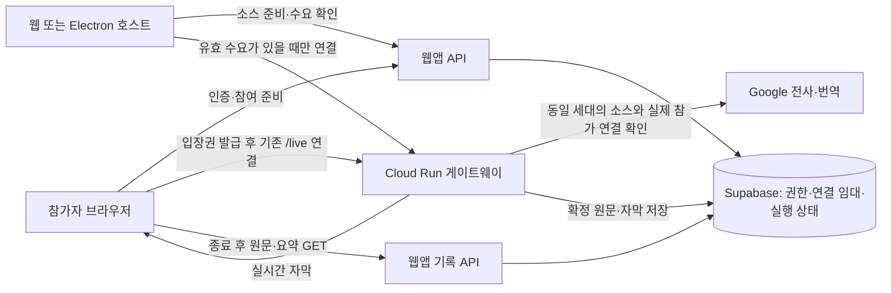
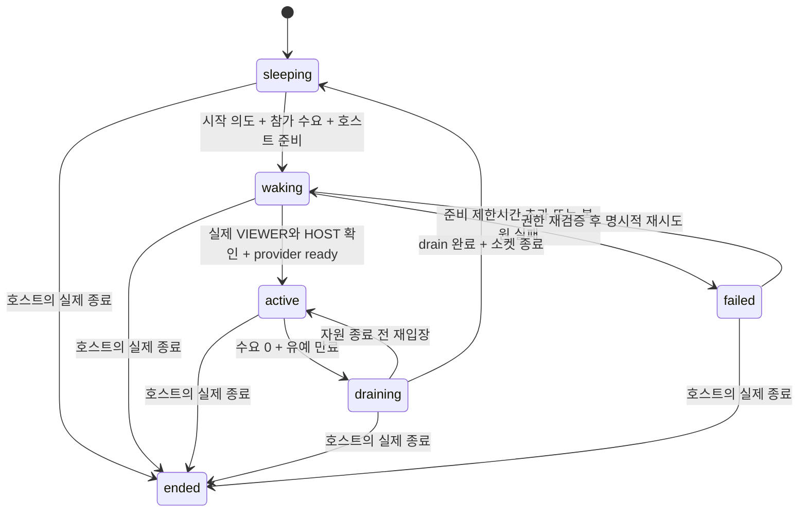

# 참여자 라이브 화면과 수요 기반 게이트웨이 설계

날짜: 2026-08-31 (한국시간)

최신 실행 결과: [구현·검증 보고서](2026-08-31-live-recap-implementation-report.md). 아래의 최초 조사/미구현 표는 설계 당시 이력이며 현재 상태는 최신 보고서를 따른다.

상태: 사용자 전체 구현 승인 후 로컬 코드·추가 마이그레이션 구현 및 검증 중. 운영 DB·클라우드는 변경하지 않았다. 런타임 플래그는 기본 꺼짐이다.

범위: NOVA `/watch`, `/m/watch`, 웹/Electron 호스트, Google 미디어 게이트웨이.

후속 확정: 캡슐 마이크 형태를 사용자가 확정했다. 이메일 수신 동의·호스트 4탭·회의 전체 Excel은 [후속 설계](2026-08-31-recap-consent-host-records-export-design.md)와 시안을 따른다. 전체 구현 승인에 따라 0명 구간은 수집을 중단하고 공백을 명시한다.

## 결정 요약

참여자가 없을 때 유료 전사·번역을 중단하고, 호스트 WebSocket까지 닫아 Cloud Run이 자동 축소할 수 있게 한다. 첫 참여자의 인증된 연결 요청으로 다시 기동한다. Cloud Run 서비스를 매 입퇴장마다 배포하거나 관리자 API로 ON/OFF하지 않는다.

수요 런타임을 로컬 구현했다. 중요한 제품 제약은 다음과 같다. 참여자 0명 동안 Google 전사를 중단하면 그 구간의 호스트 발언과 웹 호스트 자막도 생성되지 않는다. 아래 기본 설계는 그 기록 공백을 명시하는 비용 우선 안이며, 사용자의 전체 구현 승인에 포함해 처리하며 UI와 내보내기에 공백을 표시한다. 전체 원문이 필요하다면 이 안을 그대로 활성화할 수 없다.

## 1. 확정한 사용자 요구

- 최신 선택 시안 1을 유지한다. 진행 중 번역은 회색, 문장이 확정되면 같은 자리에서 흰색으로 바뀌며 이전 확정 문장도 흰색으로 남는다.
- 라이브 중 `최신 자막을 보고 있어요`와 `요약받기`를 삭제한다. 완료 문장을 요약 카드로 자동 교체하거나 접지 않는다.
- 라이브 하단 가운데에는 서버가 참가자 음성 발언을 허용했을 때만 마이크 버튼을 둔다. 허용하지 않으면 버튼·문구 없이 같은 높이의 여백을 유지한다.
- 회의 종료 후의 `원문 / AI 요약`과 `요약·원문 받기`는 유지한다. 원본은 현재 범위에서 음성 파일이 아닌 발언 원문 텍스트다.
- 동일 브라우저에서 새로고침하거나 다시 열어도 회의 종료 시각부터 6시간 동안 인증된 참여자가 원문·요약을 확인한다. 새로고침으로 기한을 연장하지 않는다.
- 호스트·참가자 권한, 발언권 검증을 유지한다. 관리자용 진단 원문을 참가자에게 그대로 공개하지 않는다.
- 배포·프로덕션 DB 변경·이메일 발송은 이번 산출물에 포함하지 않는다.

## 2. 시안과 마이크 계약

수정 시안:

[마이크 배치 수정 시안](assets/2026-08-31-live-viewer-microphone-pill.png)

이미지는 발언 허용 상태의 예시다. 숨김 상태는 동일 하단 영역에서 버튼과 라벨을 모두 제거한다. 이 문서와 이미지는 동작 구현이나 접근성 검증 결과가 아니다.

최신 사용자 수정: 마이크 아래 `발언하기` 문구를 제거하고 아이콘만 가운데 배치한다. 버튼 너비는 종료 화면의 `요약·원문 받기`와 같은 콘텐츠 너비를 사용하며, 양끝은 반원인 캡슐형(pill radius 980px)으로 한다. 보이는 글자는 없지만 스크린리더용 `발언하기`/`발언 종료` 접근성 이름은 유지한다. 생성 시안의 미세한 픽셀 차이와 별개로 실제 구현에서는 두 버튼에 같은 너비 규칙을 적용한다.

생성 방식: built-in Image Gen으로 기존 시안을 국소 수정. [최종 생성 프롬프트](assets/2026-08-31-live-viewer-microphone-pill-prompt.txt)

| 조건 | 표시 및 동작 |
|---|---|
| 회의 live, 종료 전, `participantSpeakingEnabled === true` | 하단 중앙 마이크 |
| 위 권한 있음, 미디어 ready, 발언 대기 | 텍스트 없이 마이크 아이콘만; 접근성 이름 `발언하기`. 사용자 클릭 후 권한 요청·발언권 획득 |
| 연결 준비 중 | 같은 자리에서 준비 상태, 녹음 시작 성공을 미리 표시하지 않음 |
| 발언 시작 중/발언 중 | 중단 조작 유지, `발언 종료` 접근성 이름 |
| 발언 미허용 또는 회의 종료 | 하단 마이크 없음 |
| Q&A 섹션 표시 또는 텍스트 질문 기능만 있음 | 음성 권한으로 간주하지 않음 |

현재 Q&A는 `activeSection: "qa"`라는 구간 표시이며 별도 음성 권한이 아니다. 음성 Q&A를 제공하려면 기존 서버의 발언 허용 capability를 통해 허용해야 한다. 현재 capability는 meeting 세션에 제한된다. presentation의 음성 Q&A 확대는 별도 스키마·권한 변경 범위다.

현재 발언권 요청은 손들기 대기열이 아니다. 기존 발언자를 중단시킬 수 있는 정책을 몰래 변경하지 않는다. 권한 회수·종료 시 로컬 마이크 track과 발언권을 즉시 정리한다.

디자인 토큰은 `DESIGN.md`의 웹 규칙을 사용한다. 배경 `#15151A`, 흰색, 액션 `#0071E3`, Pretendard, 일반 본문 16/24, 기존 자막 확대 기능, 최소 44px 터치 영역, 2px focus ring을 유지한다. 클릭하지 않아도 마이크 권한을 요청하는 동작은 금지한다.

## 3. 현재 코드에서 확인한 제약

파일 위치는 이 문서 작성 시점 기준이다.

| 근거 | 관찰 | 설계 영향 |
|---|---|---|
| `media-gateway/src/server.js:292`, `live-media-pipeline.js:242` | 구독 수 콜백은 주입·저장하지만 실질적 활성화 판단에 사용하지 않음 | 기존 기능으로 이미 해결됐다고 판단하지 않음 |
| `media-gateway/src/live-media-pipeline.js:342` | start가 참여자 수와 무관하게 전사 세션 시작 | provider 시작 앞에 검증된 수요 조건 필요 |
| `media-gateway/src/server.js:300` | 현재 파일은 GeminiLiveTranscriptionAdapter 사용 | 오래된 Cloud STT 메모리가 아닌 실제 adapter 경계에서 중단 |
| `media-gateway/src/gateway-server.js:2057` | viewer close는 구독 제거·발언권 반환 | 마지막 연결 이탈을 runtime 전이와 연결해야 함 |
| `media-gateway/src/live-media-pipeline.js:308` | pause는 provider 자원을 유지 | pause만으로 절전 완료가 아님 |
| `media-gateway/src/gateway-server.js:1077` | detach는 회의를 종료하지 않고 자원을 해제 | 휴면 구현의 출발점이지만 drain·세대 검증 보강 필요 |
| `media-gateway/src/gateway-server.js:1059` | stop은 주제 종료와 stopped 방송 | 참여자 0명 휴면에 재사용 금지 |
| `webapp/components/live/live-audio-client.ts:627`, `electron/main.js:1704` | live 상태의 자동 재연결 | 의도적 휴면을 명시적으로 분기해야 함 |
| `supabase/migrations/202608310001_live_session_persistence.sql:388` | viewer_count는 활성 입장권 개수 | 실제 접속자 수로 사용 금지 |
| `webapp/lib/live/activity.ts:143` | isPresent는 leftAt 여부 | unload 없는 이탈을 짧게 회수할 수 없음 |
| `webapp/lib/live/gateway-prewarm.ts:40`, `webapp/vercel.json:4` | 예약 세션 대상으로 5분 주기 health 요청 | 수요 없는 사전 기동 경로 제거 필요 |
| `media-gateway/src/gateway-server.js:1565` | provider 준비 후 회의를 live로 전환 | 호스트 시작 의도와 실제 미디어 준비를 구분 |
| `media-gateway/src/server.js:364` | 일반 seq 복원 오류를 삼킬 수 있음 | cold resume에서는 복원 실패 시 시작 거부 |
| `webapp/components/live/LiveViewer.tsx:1241` | 복구 실패 시 회의 정보 제거 경로 | 일시 오류·대기·종료 기록 복구를 인증 실패와 분리 |

Google은 열린 WebSocket이 하나라도 있으면 인스턴스를 활성 요청 처리 상태로 본다. 전사 API를 중단해도 호스트 WebSocket을 남기면 게이트웨이 실행 비용은 남는다. [Google WebSocket 문서](https://docs.cloud.google.com/run/docs/triggering/websockets)

요청 기반 과금과 min=0을 사용하고 들어오는 요청이 없어야 자동 축소가 가능하다. 물리적인 인스턴스 종료 시점은 플랫폼이 결정하므로 마지막 퇴장 직후 즉시 인스턴스 0을 보장하지 않는다. [Google 과금 문서](https://docs.cloud.google.com/run/docs/configuring/billing-settings), [Google 자동 확장 문서](https://docs.cloud.google.com/run/docs/about-instance-autoscaling)

## 4. 선택지와 비용 경계

| 안 | 0명일 때 Google 전사·번역 | 호스트 연결 / Cloud Run | 원문 |
|---|---|---|---|
| 현재 구조 | 호스트가 시작하면 계속 가능 | 연결 유지 | 생성 가능 |
| 번역만 중단 | 전사는 유지 | 계속 활성 | 생성 가능, Google 비용 남음 |
| **제안: 참여자 수요 기반 전체 휴면** | 진행 중 작업 정리 후 중단 | 호스트 연결까지 닫고 자동 축소 허용 | **휴면 구간은 생성되지 않음** |
| 전체 기록 + 별도 녹음/전사 | 다른 기록 경로 필요 | 경로에 따라 다름 | 별도 저장·개인정보·비용 설계 필요 |

이번 기본 설계에서는 호스트만 접속한 상태를 참여 수요로 계산하지 않는다. 따라서 웹 호스트의 Google 기반 자막도 휴면 중에는 중단된다. Electron의 독립 로컬 자막 엔진은 다른 경로이며, 그것이 서버 원문 전체 기록을 대신한다고 간주하지 않는다.

절감액이나 첫 입장 대기시간의 숫자는 아직 측정하지 않았다. 웹앱·DB 제어 요청, 종료 요약 생성, 저장·다운로드 등은 별도 비용이다. 서비스 전체 비용이 0이라는 약속은 하지 않는다.

## 5. 권장 아키텍처

### 5.1 회의와 미디어 상태 분리

- 기존 회의 status와 실제 `endedAt`은 업무 상태의 정본으로 유지한다.
- 별도 runtime 행에 `startRequestedAt`과 `mediaState`를 둔다. 호스트가 시작했지만 아직 첫 참가자가 없으면 미디어는 sleeping이다.
- 처음 시작할 때 기존 provider-ready CAS 이전에 일반 preparing 세션을 모두 live로 풀지 않는다. 서버가 시작 의도를 수락했고, 예정 시각 조건을 통과한 회의만 수요 등록을 허용한다.
- UI와 접속 조건은 raw status만 보지 않고 서버가 계산한 `canPrepareConnection`과 `mediaState`를 사용한다. 실제 전사 준비 전에는 `연결 준비 중`이지 `자막 수신 중`이 아니다.
- 최초 미디어 ready 뒤에는 회의 status가 live이면서 media sleeping일 수 있다. 휴면은 paused/stopped/failed로 덮어쓰지 않는다.

`ended`는 기존 회의 종료 상태에서 파생하는 최종 조건이다. 모든 전이에서 회의 종료 여부를 먼저 확인한다. provider의 파괴적 종료가 시작된 draining에는 새 소켓을 붙이지 않고 종료 완료 후 새 epoch로 기동한다.

### 5.2 실제 접속 수요

참가 등록, 대시보드 조회, QR 노출, recap 열람, 발언권 보유 여부가 아닌 **유효한 참가자 연결**을 센다. 마이크가 꺼진 시청자도 수요다.

제안 기본값은 연결 준비 임대 45초, 연결 유지 확인 15초, 연결 임대 만료 45초, 마지막 이탈 유예 30초다. 기존 구현값이 아니며 모바일·부하 검증으로 조정한다. 일반 disconnect가 확인되면 유예 후 정리하고, 알 수 없는 단절은 임대 만료 후 유예가 시작될 수 있다. 따라서 모든 이탈을 정확히 30초에 감지한다고 약속하지 않는다.

- connectionId는 연결마다 서버가 발급한다. 새로고침의 새 연결과 옛 연결의 늦은 close를 구분한다.
- pending 임대는 첫 기동 요청만 보호하며 실제 VIEWER 인증 연결을 대신하지 않는다. provider 시작에는 동일 epoch의 실제 소켓 확인이 필요하다. grant당 동시 pending은 1개이며 같은 시도의 ticket 재발급으로 expiresAt·wakeDeadline을 연장하지 않는다. 실제 연결 없이 시도를 반복하면 서버의 기동 시도 예산과 cooldown/429를 적용한다. pending만으로 이미 실행 중인 provider의 무참가자 유예를 계속 연장할 수 없다.
- connected 임대 갱신은 실제 소켓의 ping/pong 등 생존 확인 후 게이트웨이만 수행한다. 매 promote/renew에서 grant의 만료·철회, 세션 입장 가능 기간·종료, 현재 epoch·owner를 재검증하고 expiresAt을 DB now+TTL과 권한 기한 중 빠른 값 이내로 제한한다. 브라우저가 임의 만료시간·참가자 수를 쓰지 못한다.
- 등록된 모든 언어를 유지한다. 이번 변경에 언어별 구독 최적화까지 섞어 과거 번역 기록에 새 공백을 만들지 않는다.
- 다중 탭은 개별 연결로 관리한다. 마지막 유효 연결이 사라질 때만 수요 0이다.

### 5.3 0명에서 첫 참가자 입장

1. 호스트가 웹앱에서 시작 의도를 기록하고 소스 준비 임대를 유지한다. sleeping 동안 Google WebSocket은 열지 않는다.
2. 참가자의 기존 same-origin `viewer-gateway-ticket` POST를 확장한다. 입장권·세션·시작 의도·서버 시간·Origin·요청 제한을 검증한다.
3. 같은 DB 트랜잭션에서 짧은 pending 임대를 확보하고, 로컬 캡처 소스 준비 호스트가 있으면 해당 epoch의 waking 상태를 확보한다. 동시 입장은 하나의 기동 세대를 공유한다. 이 트랜잭션 안에서 외부 호출은 하지 않는다.
4. 소스 준비 호스트가 없으면 runtime은 sleeping으로 두고 ticket 대신 `202 HOST_WAITING` 상태를 반환한다. pending 수요는 호스트의 외부 제어 경로에만 전달하고 유예 없이 무한 연장하지 않는다. 이는 인증 실패가 아니며 로그아웃시키지 않는다. 참가자 화면은 웹앱 상태만 제한적으로 조회한다. 여기서 소스 준비는 게이트웨이의 ready가 아닌 사용자 허용을 받은 로컬 캡처 준비 상태다.
5. 준비된 호스트가 있으면 서버 발급 ticket·connectionId·epoch로 기존 `/live` WebSocket을 연다. **이 요청 자체가 Cloud Run을 깨운다.** 별도 Cloud Admin API, 신규 `/wake`, 무한 health 요청은 필요 없다.
6. sleeping 호스트는 기존 웹앱 상태 확인 경로에서 수요를 보고 연결한다. 웹의 기존 5초 상태 polling을 재사용하고 Electron에도 같은 계약을 적용한다. GET 조회 자체는 수요를 만들지 않는다.
7. 게이트웨이는 VIEWER ticket을 검증해 연결을 확인하고, HOST 소스·서버 설정·현재 epoch·회의 상태·단일 owner를 검증한다. **같은 유효 owner 인스턴스의 실제 HOST/VIEWER 연결**만 조합한다. 재배포 중 두 인스턴스로 연결이 갈라지면 비소유 인스턴스는 소켓을 제한시간 내 정리하고 명시적 재연결 상태를 반환한다. session affinity나 max=1만으로 동일 인스턴스 연결을 보장하지 않는다.
8. **권한·세대 검증 → DB의 원문 순번·언어별 확정 순번·주제 연결 복원 성공 → provider 하나 시작 → 수요·권한·세대 재검증 → media ready CAS → 오디오 전송 허용** 순서로 고정한다. 복원 실패라면 provider 시작은 0회여야 한다. 준비 중 발언은 녹음·버퍼링하지 않는 기본안이므로 호스트에게 준비 상태를 명확히 보여준다.

호스트의 source-ready 임대는 로그인이나 열린 대시보드만으로 갱신하지 않는다. 사용자 허용을 받은 실제 캡처 경로가 준비됐는지 확인한다. 웹 백그라운드 탭에서도 제어가 가능해야 하며, 브라우저·OS가 실행을 정지하면 임대 만료 후 HOST_WAITING으로 처리한다. 백그라운드 실행을 보장한다고 약속하지 않는다. 마이크를 새로 켜야 하는 경우 사용자 조작을 요구한다.

호스트 부재 중에는 pending 임대를 무한 연장하거나 Google 재접속을 반복하지 않는다. 호스트 복귀를 확인한 기존 대기 참가자는 새 인증 검증 후 기동을 진행할 수 있다. 실제 실패 상태의 무음 자동 재시도나 다른 provider로의 fallback은 추가하지 않는다.

이미 waking을 확보한 브라우저가 WebSocket을 열기 전에 사라지면 타이머를 실행할 게이트웨이가 없을 수 있다. runtime GET은 마감 경과를 읽기 결과로 표현할 뿐 상태를 쓰거나 Google을 깨우지 않는다. 다음 인증된 연결 준비 POST가 DB 서버시간으로 오래된 waking claim을 만료 CAS한 뒤 새 시도를 확보한다. 종료 요청도 같은 만료·세대 무효화를 수행한다.

**기동 실패·호스트 소스 상실 경로는 참여자 이탈과 별도다.** wakeDeadline 초과나 active 상태의 source-ready/owner lease 만료가 발생하면 VIEWER가 남아 있어도 신규 오디오 중지 → 가능한 범위의 bounded drain → provider 해제 → 대기 HOST/VIEWER 소켓 종료로 수렴해야 한다. 원인을 HOST_WAITING 또는 명시적 failed로 저장하고 브라우저는 웹앱 상태 확인으로 전환한다. 이 경로 없이 마지막 참가자 퇴장만 기다리면 호스트 없이 Cloud Run만 계속 켜질 수 있다. source loss 역시 실제 회의 종료나 입장권 철회로 처리하지 않는다.

### 5.4 마지막 참가자 퇴장

1. 해당 connectionId만 해제하고 같은 세션의 남은 실제 connected 수요와 별도의 pending 준비 시도를 확인한다.
2. 실제 connected 수요가 0이면 30초 유예를 설정한다. 유예 중 실제 재연결에 성공하면 취소한다. pending ticket 요청만으로 이 유예를 연장하지 않는다. 유예는 즉시 새로고침할 때 불필요한 종료·재기동을 줄인다.
3. 유예 만료 시 세션 lock과 DB epoch/owner claim 아래 실제 connected 수요를 다시 검증한다. 과거 타이머가 새 세대에 영향을 주지 못한다. pending만 남았으면 기존 provider는 drain하고, 해당 준비 시도는 남은 원래 제한시간 내 실제 연결을 확보한 경우에만 새 세대로 진행한다.
4. 신규 오디오를 차단하고 cutoff 이전에 수신한 발언의 마지막 전사·번역·저장을 마무리한다. 기존 `close()`만 호출하면 마지막 final이 거절될 수 있어 별도의 graceful drain 계약이 필요하다.
5. bounded drain 실패는 기록 불완전 상태와 명확한 오류 코드로 남긴다. 비용을 막기 위해 자원은 해제하되 완전 저장 성공으로 표시하지 않는다. 알 수 없는 저장 결과를 새 순번으로 무조건 재시도하지 않는다.
6. provider·발언권을 정리하고 sleeping을 저장한다. 실제 종료 이벤트나 종료 요약 생성은 실행하지 않는다.
7. 소켓을 닫기 전에 호스트에 `media-idle`과 이유·epoch를 전달하고, 제한된 ACK 대기 후 해당 세션의 HOST/VIEWER 소켓을 모두 닫는다. 웹/Electron은 그 세대의 WebSocket 재연결, 토큰 갱신, ensure 연결 작업을 취소한다. 의도적 idle을 장애로 취급하지 않는다.
8. idle ACK가 유실돼도 close 이후 웹앱 상태를 확인해 재접속 여부를 결정한다. 모든 호스트가 gateway 상태와 무관하게 자동으로 다시 연결하는 기존 동작은 제거한다.

다른 회의에 참가자가 남아 있으면 그 회의는 계속 실행한다. 공유 Cloud Run 인스턴스는 **전체 세션의 모든 요청·소켓이 없어졌을 때만** 0으로 축소될 수 있다. 한 회의가 비었다고 서비스 전체를 종료하지 않는다.

## 6. 데이터와 인터페이스

아래는 후속 Schema/Backend 작업의 계약이며 이번에 SQL을 실행하거나 스키마를 바꾼 것은 아니다.

| 데이터 | 최소 필드와 경계 |
|---|---|
| 신규 `live_session_runtime` | sessionId PK/FK, startRequestedAt, state, epoch, ownerId, ownerLeaseExpiresAt, idleAfter, wakeDeadline, lastErrorCode |
| 신규 `live_viewer_presence_leases` | connectionId PK, sessionId, grantId FK, epoch, pending/connected, expiresAt |
| 신규 `live_host_source_leases` | sessionId PK/FK, host identity, source generation, sourceReady, expiresAt; 실제 HOST만 갱신 |
| 기록 공백 메타데이터 | 실제 휴면 시작·종료, reason=no_audience/source_unavailable, 세션별 순서; 원문·요약에 포함 범위를 표시하기 위해 필요 |

기존 viewer_count·입장권·동의·참가 등록을 새 접속 임대로 대체하거나 삭제하지 않는다. epoch는 기존 회의 설정 version과 분리한다. heartbeat가 회의 편집 충돌을 유발하지 않게 한다.

기존 세션의 초기 runtime은 모르는 상태를 active로 추정하지 않는다. 롤아웃 시 활성 회의는 구 버전에서 종료까지 유지하고 신규 회의부터 새 계약을 사용한다. 신규 테이블은 additive migration으로 생성하며 제거/drop은 이번 범위가 아니다. connection lease 만료시간은 반드시 DB 서버 시간에서 계산한다.

| 인터페이스 | 계약 |
|---|---|
| 기존 viewer ticket POST 확장 | role=VIEWER, session-bound; ticket 준비 또는 202 대기. pending 임대 생성은 멱등적으로 제한 |
| host source heartbeat POST | HOST 소유권, 입력 검증, source generation. 참여 수요를 만들지 않음 |
| host/viewer runtime GET | 역할별 최소 상태·epoch·준비 가능 여부만 응답. 읽기만 하며 gateway를 호출하지 않음 |
| gateway lease RPC | 연결 실증과 권한 재검증 후 promote/renew/release. 권한 기한을 넘는 갱신·브라우저 직접 쓰기 금지 |
| runtime claim/CAS RPC | epoch+owner token+lease 검증, wake/ready/drain 완료를 원자적으로 처리 |
| records-session / 원문 / 요약 GET | 종료 후 전용 읽기 권한; gateway ticket 발급·임대·기동과 완전히 분리 |

신규 응답은 기존 `{ ok, data?, error?, code? }` 규칙을 따른다. HOST_WAITING, MEDIA_STARTING, SESSION_ENDED는 인증 실패와 구분한다. 장애에는 MEDIA_START_FAILED, RESTORE_FAILED 등 명확한 오류를 사용한다. 401/403만으로도 모든 로컬 회의 정보를 일괄 삭제하지 말고 실제 인증 만료·철회와 가용성 오류를 구분한다.

## 7. 6시간 열람과 새로고침 복구

1. 실제 회의 종료를 DB에서 한 번 확정한다. `accessUntil = endedAt + 6시간`이며 media idle, 탭 종료, 새로고침은 endedAt을 수정하지 않는다.
2. 종료된 회의 복구는 live 전용 `/viewer-session`에 의존하지 않는다. 참가자에게 세션별 읽기 전용 복구 인증을 제공하고 별도 records-session 경로로 검증한다.
3. 종료 이벤트를 못 받은 탭도 복구할 수 있도록 복구 인증의 발급 시점은 종료 응답에만 의존하면 안 된다. admission 시점부터 보유할 수 있는 HttpOnly 세션별 읽기 인증과 서버 membership 검증을 설계한다.
4. 기존 recap의 30일 토큰 수명은 6시간 열람 정책과 동일하지 않다. 서명된 인증의 유효성뿐 아니라 모든 기록 API에서 서버의 endedAt+6시간, 사용자·세션·철회·호스트 공개 정책을 함께 검사한다. 종료 후 정리될 수 있는 활성 viewer grant의 존재를 요구하지 않고 보존된 참가자 membership과 세션별 읽기 접근 철회를 확인한다. 일반적인 연결 종료·소모성 grant 정리와 명시적인 기록 접근 철회를 구분한다. 쿠키 TTL만 고쳐서 해결했다고 판단하지 않는다.
5. RECAP/읽기 복구 인증은 live 입장권, wake, 마이크 발언권으로 사용할 수 없다. URL에 bearer token을 넣거나 브라우저 저장소에 원문·요약·민감정보를 저장하지 않는다.
6. 원문·요약은 DB에서 복원한다. 로컬에는 세션 식별자·선택 탭·불투명 스크롤 위치 정도만 보존한다. 5xx/연결 대기/일시 장애는 기록 삭제·로그아웃 대신 `다시 불러오기`로 처리한다.
7. 요약 생성 상태는 pending/ready/failed로 영속화한다. 새로고침은 작업 상태를 조회할 뿐 동일 요약 작업을 중복 생성하지 않는다. 준비 중에도 원문은 열람 가능하다.
8. 6시간 이후에는 `열람 기간이 끝났어요`를 표시한다. 이는 데이터 물리 삭제와 다르다. 쿠키를 삭제하거나 다른 브라우저를 사용해도 자동 복구된다는 약속은 하지 않는다.

0명 구간이 기록되지 않는 안을 승인하면 요약 모델에도 실제 수집된 원문과 공백 구간 정보를 제공한다. 수집되지 않은 내용을 추정해 채우거나 `전체 회의 원문`이라고 표시하지 않는다. `전체 발언 원문` 파일명도 기록 범위와 공백 안내를 함께 제공해야 한다.

## 8. 클라우드 설정과 운영

- 요청 기반 과금, 서비스·리비전 최소 인스턴스 0. 0이 아닌 최소값의 이전 revision/traffic tag도 확인한다.
- 기존 단일 인스턴스 fanout 전제를 유지하고 max=1을 무심코 높이지 않는다. 재배포 중 세대 중첩도 있을 수 있어 max=1을 분산 lock 대신 믿지 않는다.
- 세션별 owner lease와 epoch로 중복 provider를 방지한다. 게이트웨이가 lease를 갱신할 수 없으면 유효기간 내에서만 처리하고, 만료 전 신규 오디오를 중지·자원을 닫는다. 늦게 도착한 final도 유효한 owner만 영속화한다.
- 기존 5분 예약 prewarm과 선택적 호스트 prewarm이 참가자 없이 요청하지 않도록 제거·수요 조건화한다. 수요 없는 시간에는 외부 uptime ping으로 서비스를 깨우지 않는다.
- 프로세스 liveness 점검이 provider를 생성해서는 안 된다. Cloud Run 내부 상태 점검과 외부에서 서비스를 깨우는 주기적 요청을 구분한다.
- 60분 WebSocket 제한의 정상 재연결은 유효 수요가 있을 때만 수행한다. 단순 연결 수 순간 감소를 회의 종료로 해석하지 않는다.
- 기록 조회, recap polling, 종료 요약 작업은 실시간 gateway에 의존하지 않는다. 종료 요약 작업의 유료 호출은 별도 예산·실행 완료 경계로 관리한다.
- 제어 API 요청·공개 gateway로의 비정상 트래픽까지 비용이 절대 발생하지 않는다고 보장할 수 없다. 입장권 발급 제한, 시작 시도 예산, 익명 연결의 짧은 인증 timeout, 콘텐츠 없는 관측 지표를 적용한다.

## 9. 구현 작업 분해

사용자 확인 후 아래 경계로 실행한다. 이번 문서는 구현 완료 보고가 아니다.

| 담당 | 파일 소유 범위 | 의존성 |
|---|---|---|
| Schema | `supabase/migrations/`, `supabase/README.md` | runtime/lease/RPC/기록 범위, 신규 회의 기본값, 복구 권한 계약 먼저 |
| Backend 제어 | `webapp/lib/live/`, `webapp/app/api/live-sessions/`의 runtime·ticket·records 경로 | Schema 계약 |
| Security | `webapp/lib/auth/`, `webapp/lib/security/` | 역할별 토큰, Origin, scope, 시간·rate limit; API 담당과 인터페이스 합의 |
| Gateway | `media-gateway/src/`와 해당 테스트 | lease adapter, provider gate, 단일 owner, graceful drain, 재시드 |
| Host | `live-audio-client.ts`, `LiveHostDashboard.tsx`, `electron/main.js` 관련 파일 | runtime 응답·idle 이벤트 확정 후 양 경로 적용 |
| Design | `LiveViewer.tsx`, `MeetingMinutes.tsx`, translation 컴포넌트·CSS, PC/모바일 demo | 참가자 연결·읽기 복구 API 확정 |
| 운영 | `webapp/vercel.json`, gateway prewarm·검증 스크립트와 runbook | 새 수요 경로 검증 후 prewarm 해제 |

한 파일을 두 담당이 동시에 수정하지 않는다. 공유 API DTO를 먼저 정하고 파일별 변경 순서를 고정한다. 알려진 종료 후 transcript의 source/topic 매핑 누락도 Backend↔Design 계약 검증에 포함한다.

## 10. 위험 등록부

| 위험 | 완화 |
|---|---|
| 참여자 0명 동안 기록 공백·웹 호스트 자막 중단 | 사용자 정책 확인, 실제 수집 구간 표시, 완전 기록과 절전 혼동 금지 |
| 최초 입장 지연·호스트 부재 | 시작 의도/source-ready/실제 viewer를 분리; bounded 준비 상태와 명시적 실패 |
| 마지막 퇴장과 재입장 경합 | 연결별 임대, 30초 유예, 같은 세션 lock, epoch CAS, 파괴적 종료 전후 분리 |
| 창 종료·모바일 백그라운드로 유령 참여자 | 서버시간 lease+소켓 생존 확인; unload 이벤트만 믿지 않음 |
| 휴면 직전 마지막 문장 유실 | cutoff 기반 drain, 확정 저장 완료 확인, 불완전 상태를 성공으로 숨기지 않음 |
| 새로고침 시 인증 상실·기한 연장 | 기록 전용 복구 경로, endedAt+6시간 서버 검증, 일시 오류에서 인증 삭제 금지 |
| 재연결/prewarm/여러 회의로 절전 무력화 | 모든 호스트 경로·예약 ping 검사, 세션과 서비스 전체 수요 구분, 실제 지표 확인 |

## 11. 적대적 검증 계획과 현재 결과

| 항목 | 검증해야 할 상황 | 이번 상태 |
|---|---|---|
| A1 동시성 | 100명 첫 입장에 provider 1개; refresh 옛 close가 새 연결을 지우지 않음; drain과 join/종료 경합 | 설계 검토; 신규 동작 미구현 |
| A2 권한 | 다른 회의 ticket/만료 grant/RECAP으로 wake 거절; Q&A 라벨만으로 발언 불가 | 기존 경계 정적 확인; 신규 통합 검증 대기 |
| A3 CSRF | 유사 Origin·누락 Origin으로 ticket/host heartbeat 변경 거절 | 기존 strict Origin 확인; 신규 endpoint 검증 대기 |
| A4 XSS | 원문·AI 요약의 markup이 실행되지 않음, 파일 생성 시 이름·내용 경계 검증 | 텍스트 렌더링 경계 유지 계획 |
| A5 SSRF | 사용자 gateway URL·클라우드 대상 입력 거부, 고정 endpoint만 사용 | 새 wake URL을 만들지 않는 설계 |
| A6 입력·시간 | 서버시각 6시간 직전/직후, 잘못된 epoch·UUID·seq, 긴 문장·다국어 | 테스트 명세 완료, 실행 전 |
| A7 잔류 상태 | 0명 drain 후 provider·HOST/VIEWER 소켓·timer 0; recap 조회로 wake 0; 최종 문장 저장 | 테스트 명세 완료, 실행 전 |
| A8 기기 | PC/모바일 320–1440px, 200% 확대, 마이크 허용/미허용, 권한 회수, 숨긴 호스트탭·OS 절전 | 수정 이미지 확인; 실제 브라우저 기능 검증 전 |

추가 수락 기준:

1. 0명에서 호스트 시작 시 Google provider 호출·gateway 연결 0회.
2. 첫 실제 참가자와 준비된 호스트가 연결될 때만 provider 시작. ticket만 받고 닫은 탭은 전사를 시작시키지 않음.
3. 일시적 재연결은 허용하되 명시적 idle 이후 Google 재연결·health ping 0회.
4. DB seq 복원 실패 시 provider 시작 0회. 복원 성공 시 확정 순번이 이전보다 뒤에서 이어짐.
5. 새로고침으로 final 문장/요약/인증이 유실되지 않으며 같은 절대 열람 기한을 유지.
6. 회의 실제 종료 시 늦은 wake/ready/final이 회의를 부활시키지 못함.
7. 종료 후 6시간 원문·요약 열람과 저장은 gateway HTTP/WebSocket 요청 0회.
8. 마이크 미허용 상태는 빈 하단 공간이며 자동 getUserMedia 호출 0회.
9. 재배포 중 HOST/VIEWER가 다른 인스턴스에 분리돼도 중복 provider가 생기거나 비소유 소켓이 무기한 남지 않음.
10. pending만 반복 발급해도 기존 provider의 무참가자 유예가 늘어나지 않음. grant 만료·철회 이후 ping/pong만으로 lease를 갱신할 수 없음.
11. HOST 소스 소실·기동 제한시간 초과는 VIEWER가 남아 있어도 provider와 대기 소켓을 닫음. gateway 없는 abandoned waking은 다음 인증된 준비 POST에서 CAS로 회수됨.

설계 교차 검토에서 지적된 복원/기동 순서, 호스트 소실 시 정리 누락, 버려진 기동 claim 회수, lease 권한 재검증, 인스턴스 분할 연결, pending 반복 발급의 6개 항목을 위 계약에 반영했다. 문서상의 방어 규칙이며 실제 테스트 통과를 의미하지 않는다.

이번 확인에서 기존 `gateway-server`, `server`, `durable-caption-recovery` 로컬 테스트 57개가 통과했다. 이는 기존 기반 검증이며 신규 수요 기반 기동이나 6시간 복구 기능의 통과 증거가 아니다. 런타임을 바꾸지 않았으므로 신규 전체 typecheck/lint/브라우저 기능 시연을 수행했다고 주장하지 않는다.

## 12. 롤아웃과 되돌리기

1. 수정 시안과 기록 공백 정책을 확정한다.
2. 로컬/개발 환경에서 additive schema와 새 제어 경로를 구현한다. 기존 active 회의를 강제 전환하지 않는다.
3. 새 회의에만 적용하여 실제 첫 입장·마지막 퇴장·재입장·종료 후 복구를 시연한다.
4. provider 호출 수·소켓 수·idle 재접속·기록 범위·새로고침 결과를 확인한다. 테스트 전송은 격리된 개발 데이터만 사용한다.
5. 사용자의 명시적 배포 명령 후에만 DB migration·클라우드 설정·서비스 배포를 실행한다.
6. 되돌릴 때는 신규 회의의 demand 모드를 비활성화하고 호환되는 구 경로로 되돌린다. 추가 테이블·원문·요약은 삭제하지 않는다. 사라진 휴면 구간 발언을 롤백으로 복원할 수는 없음을 명시한다.

## 출처

- [Google Cloud Run WebSockets](https://docs.cloud.google.com/run/docs/triggering/websockets)
- [Google Cloud Run billing settings](https://docs.cloud.google.com/run/docs/configuring/billing-settings)
- [Google Cloud Run autoscaling](https://docs.cloud.google.com/run/docs/about-instance-autoscaling)
- [Google Cloud Run minimum instances](https://docs.cloud.google.com/run/docs/configuring/min-instances)
- 기존 저장소 `DESIGN.md`, `media-gateway/README.md`, `docs/superpowers/specs/2026-08-15-gateway-scale-to-zero-design.md`와 위 코드 경로.
